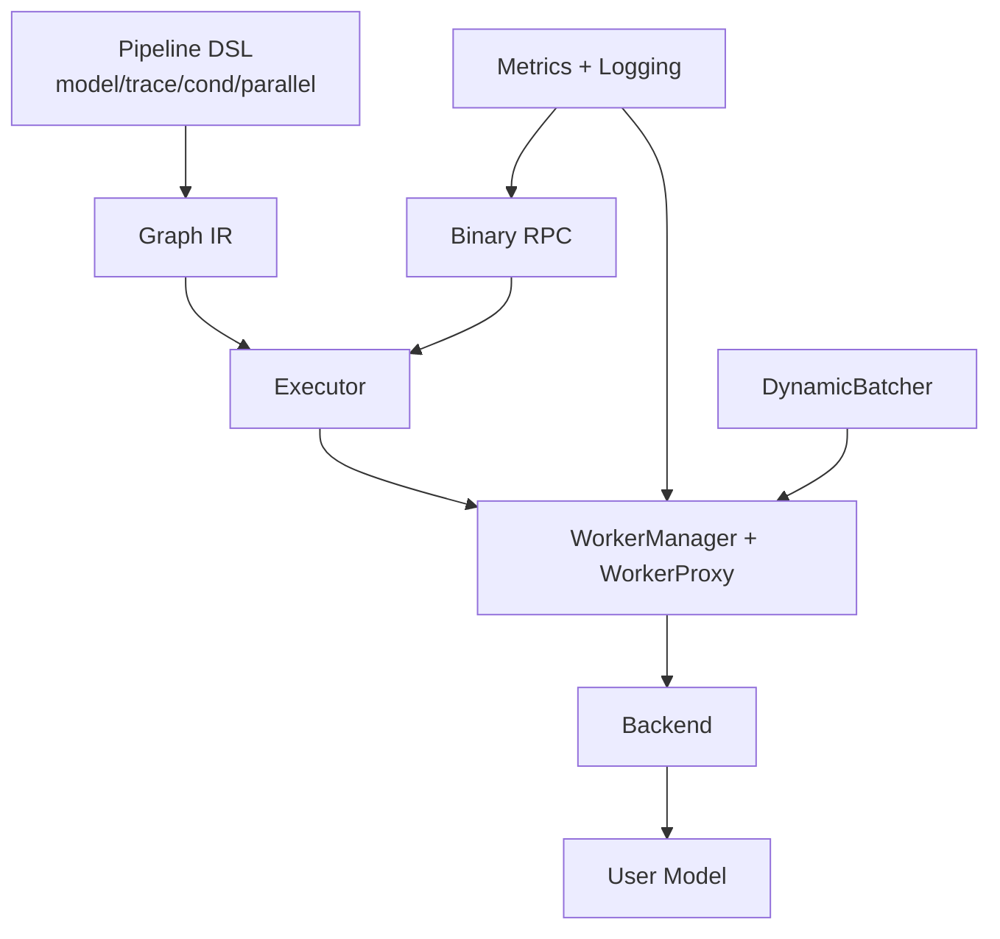

# Nerva 功能设计

更新时间：2026-03-03

## 1. 功能模块总览

## 2. 模块设计明细

### 2.1 Pipeline DSL 与 Graph（`src/nerva/core`）

核心设计：
- `model(...)` 只做声明，不立即加载模型。
- `trace(fn)` 将 Python 函数转换为 `Graph(nodes, edges)`。
- `Proxy` 的 `__getitem__` 记录字段路径，用于下游字段选择。
- `cond`/`parallel` 以“子图”形式嵌入主图。

关键 API：

| API | 文件 | 作用 |
|---|---|---|
| `model(name, model_class, backend, device, **options)` | `core/model.py` | 声明模型并注册 `ModelHandle` |
| `trace(fn, num_inputs=1)` | `core/proxy.py` | 追踪 pipeline 函数并产出 DAG |
| `parallel(*fns)` | `core/primitives.py` | 构建并行分支子图 |
| `cond(predicate, true_fn, false_fn)` | `core/primitives.py` | 构建条件分支子图 |

### 2.2 DAG 执行器（`src/nerva/engine/executor.py`）

核心设计：
- 事件驱动调度：节点完成后立即唤醒后继节点。
- fail-fast：任一节点异常时，取消剩余运行任务。
- `resolve_field_path` 支持从上游输出抽取嵌套字段。

关键 API：

| API | 输入 | 输出 |
|---|---|---|
| `Executor(graph, proxies, context)` | Graph + 模型代理映射 | 可执行器实例 |
| `execute(inputs)` | pipeline 输入 | 最后拓扑节点输出 |

### 2.3 动态批处理（`src/nerva/engine/batcher.py`）

核心设计：
- `DynamicBatcher` 作为 `InferableProxy` 包装层，透明代理 `infer()`。
- 结合 `max_batch_size` 与 `max_delay_ms` 做批次聚合。
- 包含 deadline 准入和 queue backpressure。

关键配置：`BatchConfig`
- `max_batch_size`
- `max_delay_ms`
- `queue_capacity`
- `queue_timeout_ms`
- `min_remaining_deadline_ms`

### 2.4 进程管理与 IPC（`src/nerva/worker`）

核心设计：
- `WorkerManager` 管理 worker 生命周期（启动、重启、关停）。
- `WorkerProxy` 是 master 侧异步 RPC 包装。
- `worker/process.py` 的 `_WorkerLoop` 在子进程内处理消息并执行后端推理。
- `Descriptor` 抽象 inline/SHM 双通道载荷。

关键消息类型：
- `LOAD_MODEL` / `LOAD_MODEL_ACK`
- `INFER_SUBMIT` / `INFER_ACK`
- `SHM_ALLOC_REQUEST` / `SHM_ALLOC_RESPONSE`
- `CANCEL` / `HEALTH_CHECK` / `SHUTDOWN`

### 2.5 服务层（`src/nerva/server`）

核心设计：
- `protocol.py` 定义 frame header 编解码。
- `rpc.py` 负责 header 校验、frame 解析、异常映射、响应组帧。
- `serve.py` 负责 pipeline 到 executor 构建与 app 生命周期管理。
- `app.py` 统一暴露 `RPC + health + models + metrics` 路由。

关键 API：

| API | 文件 | 作用 |
|---|---|---|
| `build_nerva_app(pipelines)` | `server/serve.py` | 返回可挂载到 ASGI 的 app |
| `serve(pipelines, host, port)` | `server/serve.py` | 阻塞式启动 uvicorn |
| `RpcHandler.handle(request)` | `server/rpc.py` | 处理 unary binary RPC |

### 2.6 后端抽象与实现（`src/nerva/backends`）

核心设计：
- `Backend` 抽象统一了 `load_model/unload_model/infer/infer_stream`。
- 内置 `pytorch` 后端和 `vllm` 后端。
- 注册机制：`@register_backend("name")`。

内置后端差异：

| 后端 | 特点 | 典型输入 |
|---|---|---|
| `PyTorchBackend` | 调用用户自定义 `Model`，通用性强 | 任意 `dict[str, Any]` |
| `VLLMBackend` | 面向 LLM 文本生成，依赖 `vllm` | `prompt/max_tokens/...` |

### 2.7 可观测性（`src/nerva/observability`）

核心设计：
- 指标集中在 `NervaMetrics`，支持自定义 registry（测试隔离）。
- `configure_logging` 支持 dev console 与生产 JSON 两种渲染模式。
- `RpcHandler` 会绑定并清理 `request_id` 上下文。

## 3. 关键数据流

### 3.1 Trace 到执行的数据流

### 3.2 RPC 层错误码映射

- `INVALID_ARGUMENT(3)`：协议错误、缺失 header、无效 payload、未知 pipeline。
- `DEADLINE_EXCEEDED(4)`：请求 deadline 已过或执行超时。
- `RESOURCE_EXHAUSTED(8)`：排队或资源不足。
- `INTERNAL(13)`：其他未分类异常。

## 4. 对外集成建议

- 构图阶段只依赖 `model + trace`，不触发真实模型加载。
- 生产环境建议使用 `build_nerva_app`，交由标准 ASGI 进程管理。
- 若 pipeline 使用 `cond/parallel`，需优先补该路径回归测试。
- 若请求体较大，建议配置/验证 SHM 路径，避免控制通道过载。

