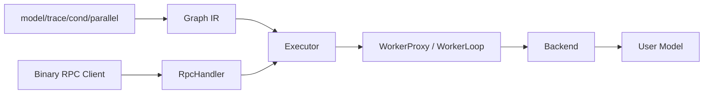

# Nerva 功能设计

更新时间：2026-03-03

## 1. 从功能链路看系统



可以把它理解成四段：
- 定义：把 Python 函数变成图。
- 执行：按图调度节点。
- 通信：跨进程执行模型。
- 服务：统一入口、错误码和观测。

## 2. 模块一：DSL 与 Graph

对应代码：`src/nerva/core/*`

### 2.1 关键 API

- `model(...)` 声明模型句柄，不立即加载。
- `trace(fn)` 在追踪上下文里把函数调用变成 `Graph`。
- `cond/parallel` 生成控制流节点及子图。

一个最小样例（把几个 API 串在一起）：

```python
from nerva import build_nerva_app, cond, model, parallel, trace

text_encoder = model("text_encoder", TextEncoderModel, backend="pytorch", device="cpu")
image_encoder = model("image_encoder", ImageEncoderModel, backend="pytorch", device="cpu")
fusion = model("fusion", FusionModel, backend="pytorch", device="cpu")

def pipeline(inp):
    primary = cond(
        inp["route_text"],
        lambda: text_encoder({"text": inp["text"]}),
        lambda: image_encoder({"image_bytes": inp["image_bytes"]}),
    )

    title_feat, body_feat = parallel(
        lambda: text_encoder({"text": inp["title"]}),
        lambda: text_encoder({"text": inp["body"]}),
    )

    return fusion(
        {
            "primary": primary["features"],
            "title": title_feat["features"],
            "body": body_feat["features"],
        }
    )

graph = trace(pipeline)
app = build_nerva_app({"mm": graph})
```

### 2.2 关键数据结构

| 对象 | 作用 |
|---|---|
| `ModelHandle` | 持有模型声明信息（backend、device、options） |
| `Proxy` | trace 阶段占位值，记录来源节点与字段路径 |
| `Graph/Node/Edge` | DAG 表达，供执行器解释 |

### 2.3 改动注意

- 改 `Proxy` 或 `primitives` 时，优先看分支图边界是否还成立。
- `src_field_path` 与 `dst_input_key` 的语义必须保持一致，否则执行期容易拿错输入。

## 3. 模块二：Executor

对应代码：`src/nerva/engine/executor.py`

### 3.1 执行策略

`Executor.execute()` 的核心是事件驱动调度：
- 根据入度找可执行节点。
- 节点完成后推进后继节点。
- 任一节点失败后，取消其余任务并返回错误。

### 3.2 事件驱动调度细节

`Executor` 的调度不是“按拓扑序 for 循环”这种串行模式，而是事件驱动：
- 初始化时先计算每个节点的入度。
- 所有入度为 0 的节点立即 `create_task` 运行。
- 每个节点完成后，把自己的 `node_id` 放进 `done_queue`。
- 主循环消费 `done_queue`，递减后继节点入度，入度归零即调度。

这样做的直接收益是：图中可并行的部分不会被串行框架阻塞，尤其在多分支 DAG 场景里效果明显。

### 3.3 节点输入组装规则

`_build_node_inputs()` 的行为分三种：
- 无入边：用 pipeline 原始输入。
- 多入边且带 key：组 dict。
- 单入边无 key：透传上游输出（可含字段路径提取）。

这块是常见 bug 来源，改动前建议先补回归。

## 4. 模块三：批处理与 SHM

对应代码：`src/nerva/engine/batcher.py`, `src/nerva/engine/shm_pool.py`

### 4.1 DynamicBatcher

`DynamicBatcher` 包装 `infer()` 调用，负责：
- 聚合短窗口请求。
- 处理 queue backpressure。
- 在 deadline 不足时尽早拒绝。

关键参数：`BatchConfig`（`max_batch_size`, `max_delay_ms`, `queue_capacity` 等）。

### 4.2 ShmPool

大 payload 场景下，descriptor 只传元数据，真实字节在共享内存中。这样能降低控制通道压力，也减少重复拷贝。

## 5. 模块四：Worker 与 IPC

对应代码：`src/nerva/worker/*`

### 5.1 WorkerManager

职责是把 worker 生命周期管完整：启动、健康检查、重启、关停、清理。

### 5.2 WorkerProxy

主进程侧统一调用口：
- `load_model`
- `infer`
- `cancel`
- `health_check`
- `shutdown`

`request_id` 必须唯一。重复 request_id 会直接破坏 pending future 映射。

### 5.3 WorkerLoop

子进程侧按消息类型处理：
- `LOAD_MODEL`
- `INFER_SUBMIT`
- `SHM_ALLOC_RESPONSE`
- `CANCEL`
- `SHUTDOWN`

## 6. 模块五：服务层与协议

对应代码：`src/nerva/server/*`

### 6.1 对外入口

- `build_nerva_app(pipelines)`：返回 ASGI app，推荐用于托管模式。
- `serve(pipelines, host, port)`：阻塞启动，适合快速起服务。

### 6.2 RpcHandler 负责什么

- header 与 frame 校验。
- deadline 转换与请求上下文绑定。
- 调 executor 执行。
- 异常到错误码映射。
- 指标和日志统计。

当前协议主路径是 unary（二进制帧，`x-nerva-stream=0`）。

## 7. 模块六：Backend 体系

对应代码：`src/nerva/backends/*`

### 7.1 抽象层

`Backend` 定义统一生命周期：`load_model`、`unload_model`、`infer`、`infer_stream`。

核心 API 对照：

| API | 作用 | 典型调用方 |
|---|---|---|
| `load_model(config)` | 加载模型和运行时资源 | WorkerLoop 处理 `LOAD_MODEL` |
| `unload_model()` | 释放模型和资源 | WorkerLoop 清理阶段 |
| `infer(inputs, context, batch_meta)` | 单次推理 | WorkerLoop 处理 `INFER_SUBMIT` |
| `infer_stream(inputs, context)` | 流式推理 | 流式调用路径（后续扩展） |

### 7.2 内置实现

- `PyTorchBackend`：直接承接用户 `Model`。
- `VLLMBackend`：面向文本生成场景，vLLM 依赖在 `load_model()` 时加载。

一个最小 backend 实现样例：

```python
from typing import Any

from nerva.backends.base import Backend, BatchMeta, InferContext, ModelConfig


class EchoBackend(Backend):
    def __init__(self) -> None:
        self._loaded = False

    async def load_model(self, config: ModelConfig) -> None:
        self._loaded = True

    async def unload_model(self) -> None:
        self._loaded = False

    async def infer(
        self,
        inputs: dict[str, Any],
        context: InferContext,
        batch_meta: BatchMeta | None = None,
    ) -> dict[str, Any]:
        if not self._loaded:
            raise RuntimeError("model not loaded")
        if context.cancelled:
            raise RuntimeError("request cancelled")
        return {"echo": inputs}

    async def infer_stream(self, inputs: dict[str, Any], context: InferContext):
        yield {"echo": inputs}
```

## 8. 模块七：可观测性

对应代码：`src/nerva/observability/*`

- 指标容器：`NervaMetrics`
- 日志配置：`configure_logging`
- 实操建议：把指标波动和 `request_id` 日志放在一起看，定位速度会快很多。

## 9. 扩展建议（常见需求）

### 9.1 新增 backend

1. 新建 backend 实现并注册。
2. 补对应 backend 测试。
3. 用 `model(..., backend="new_backend")` 走通最小链路。

### 9.2 新增服务治理逻辑

1. 先判断逻辑属于入口层还是执行层。
2. 若改协议字段，先补协议层测试。
3. 至少补一条 RPC 单测和一条 E2E 测试。

### 9.3 新增控制流原语

1. 在 `primitives.py` 定义 trace 语义。
2. 在 `Executor` 实现 runtime 解释。
3. 补图层 + 执行层回归测试。

## 10. 已知风险提醒

`cond/parallel` 分支捕获上游 `Proxy` 是历史高风险点。涉及这部分改动时，建议把超时断言和语义断言一起加上，避免“看起来没报错，但结果是错的”。
