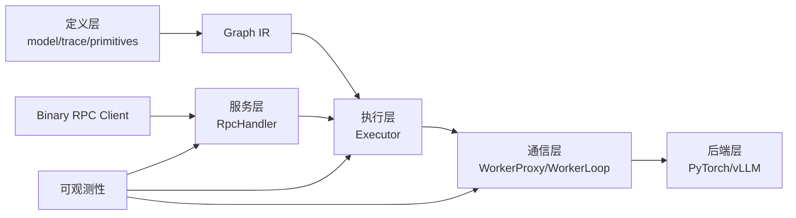

# Nerva 功能设计

更新时间：2026-03-03

口径说明：本文按当前代码实现组织，重点讲“模块怎么协作、为什么这么做、改动时该注意什么”。

## 1. 功能视角总览

从业务使用者视角，Nerva 的功能链路可以分成四层：

1. 定义层：用 `model + trace + cond/parallel` 定义可执行图。
2. 执行层：用 `Executor` 在 runtime 解释图并调度节点。
3. 通信层：用 `WorkerProxy/WorkerLoop` 跨进程执行模型推理。
4. 服务层：用 `RpcHandler` 暴露统一 Binary RPC 接口。



## 2. 模块 1：Pipeline DSL 与 Graph IR

对应代码：`src/nerva/core/*`

### 2.1 这个模块在解决什么

它把“写 pipeline 函数”转换成“可执行 DAG”。这样做的意义是：
- 用户表达保持 Python 直觉，降低接入门槛。
- 框架内部拿到结构化图，便于调度、并行和治理。

### 2.2 关键对象

| 对象 | 作用 | 关键字段 |
|---|---|---|
| `ModelHandle` | 模型声明句柄（非立即加载） | `name`, `backend`, `device`, `options` |
| `Proxy` | trace 阶段的占位值 | `source_node_id`, `_field_path` |
| `Graph` | DAG 容器 | `nodes`, `edges` |
| `Node` | 图节点 | `id`, `model_name`, `node_type` |
| `Edge` | 依赖边 | `src`, `dst`, `src_field_path`, `dst_input_key` |

### 2.3 关键 API

```python
from nerva import model, trace, cond, parallel

handle = model("echo", EchoModel, backend="pytorch", device="cpu")
graph = trace(lambda inp: handle(inp))
```

- `model(...)`：声明模型并注册句柄。
- `trace(fn)`：执行一次“追踪调用”，产出 `Graph`。
- `cond(...)` / `parallel(...)`：在图里嵌入控制流节点与子图。

### 2.4 设计上的取舍

- 优先保留函数表达能力，而不是让用户先写静态 JSON/YAML 图。
- `trace` 只负责“结构收集”，不做运行时优化器，减少实现复杂度。
- 对分支图做边界校验，避免隐式跨图依赖导致语义错乱。

## 3. 模块 2：Executor（图执行引擎）

对应代码：`src/nerva/engine/executor.py`

### 3.1 执行语义

- 执行入口：`await Executor(...).execute(inputs)`。
- 调度模型：in-degree + 事件队列（`done_queue`）驱动。
- 节点类型：
  - `call`：调用对应模型代理。
  - `parallel`：并发执行分支子图。
  - `cond`：按 predicate 选择一个子图执行。

### 3.2 输入组装规则（常见踩坑点）

`_build_node_inputs` 有三套行为：
- 无入边：直接接 pipeline 原始输入。
- 入边都带 `dst_input_key`：组装成 dict 输入。
- 单入边无 key：透传上游输出（可附带 field_path 提取）。

这也是为什么 `Proxy.__getitem__` 会记录字段路径：执行期要用到。

### 3.3 错误策略

- fail-fast：任一节点失败，取消剩余任务并上抛。
- 这是有意为之，目的是防止出现“部分节点还在跑，但请求已经判定失败”的资源浪费。

## 4. 模块 3：动态批处理与共享内存池

对应代码：`src/nerva/engine/batcher.py`, `src/nerva/engine/shm_pool.py`

### 4.1 DynamicBatcher 的定位

`DynamicBatcher` 是 `InferableProxy` 透明包装层，适合放在模型代理前：
- 聚合短时间窗口请求，提升吞吐。
- 队列满时做 backpressure（`RESOURCE_EXHAUSTED`）。
- 对超时请求做 deadline 过滤，避免浪费计算。

### 4.2 ShmPool 的定位

当 payload 较大时，IPC 控制消息只传 descriptor，真实字节在 SHM：
- 减少控制通道负担。
- 降低重复拷贝开销。
- 当前内置 size-class 池化策略，便于快速分配/回收。

## 5. 模块 4：Worker 生命周期与 IPC 协议

对应代码：`src/nerva/worker/*`

### 5.1 WorkerManager

`WorkerManager.start_worker(handle)` 负责：
1. 启动子进程。
2. 建立 `WorkerProxy` 通道。
3. 发送 `LOAD_MODEL` 并等待 ACK。
4. 维护 worker 状态与指标。

### 5.2 WorkerProxy

主进程侧能力：
- `load_model(...)`
- `infer(inputs, context, shm_pool=None)`
- `cancel(request_id)`
- `health_check()`
- `shutdown()`

关键点：
- `request_id` 必须唯一，避免 pending future 混淆。
- 超时后会尝试 cancel，并清理 pending 状态。
- 大输出支持向主进程申请 SHM 槽位后回写。

### 5.3 WorkerLoop

子进程侧 `_WorkerLoop` 处理消息分发：
- `LOAD_MODEL`：实例化 backend 并加载模型。
- `INFER_SUBMIT`：反序列化输入、执行推理、回发 ACK。
- `CANCEL`：设置 `context.cancelled` 并取消任务。
- `SHUTDOWN`：优雅退出循环并清理资源。

### 5.4 消息契约

| 消息 | 方向 | 说明 |
|---|---|---|
| `LOAD_MODEL` | Master -> Worker | 加载模型 |
| `LOAD_MODEL_ACK` | Worker -> Master | 加载结果 |
| `INFER_SUBMIT` | Master -> Worker | 推理请求 |
| `INFER_ACK` | Worker -> Master | 推理结果/错误 |
| `SHM_ALLOC_REQUEST` | Worker -> Master | 申请输出 SHM 槽位 |
| `SHM_ALLOC_RESPONSE` | Master -> Worker | SHM 分配应答 |
| `CANCEL` | Master -> Worker | 取消请求 |
| `HEALTH_CHECK` | Master -> Worker | 健康检查 |
| `SHUTDOWN` | Master -> Worker | 进程关闭 |

## 6. 模块 5：服务层与 Binary RPC

对应代码：`src/nerva/server/*`

### 6.1 服务入口

- `build_nerva_app(pipelines)`：返回 ASGI app，适合由宿主托管。
- `serve(pipelines, host, port)`：阻塞启动模式。

### 6.2 协议入口治理

`RpcHandler` 在入口做统一治理：
- 必要 header 校验。
- 二进制 frame 解码和业务 payload 解析。
- deadline 转换（绝对时间 -> TTL）。
- 错误码标准化映射。
- 指标采集与日志上下文绑定。

### 6.3 当前协议边界

- 当前主路径为 unary 调用（`x-nerva-stream` 仅支持 `0`）。
- 响应以 `DATA + END` frame 返回。
- `protocol.py` 限制了帧头规范和最大 payload 约束。

## 7. 模块 6：Backend 抽象与实现

对应代码：`src/nerva/backends/*`

### 7.1 抽象层

`Backend` 约束统一生命周期：
- `load_model`
- `unload_model`
- `infer`
- `infer_stream`

这让上层执行器不用关心模型后端具体实现。

### 7.2 PyTorchBackend

- 直接实例化用户 `Model` 子类。
- `load()`/`infer()`/`unload()` 都沿用户模型实现走。
- 适合通用 Python 模型逻辑。

### 7.3 VLLMBackend

- 面向 LLM 文本生成场景。
- 将 vLLM 依赖延迟到 `load_model()`，避免 import 阶段硬依赖。
- deadline 用超时机制保护，输出结构聚焦文本结果。

## 8. 模块 7：可观测性

对应代码：`src/nerva/observability/*`

- 指标容器：`NervaMetrics`。
- 日志配置：`configure_logging(dev=...)`。
- 推荐实践：在故障分析中将 `/metrics` 指标曲线与 `request_id` 链路日志联合看。

## 9. 扩展指南（开发者最常用）

### 9.1 新增 Backend

1. 在 `src/nerva/backends/` 新建实现类，继承 `Backend`。
2. 用 `@register_backend("your_backend")` 注册。
3. 补 `tests/test_<backend>_backend.py`。
4. 通过 `model(..., backend="your_backend")` 接入。

### 9.2 新增服务端治理能力

1. 评估入口层（`RpcHandler`）还是执行层（`Executor`）更合适。
2. 若涉及协议字段，先改 `protocol.py` / header 契约。
3. 补 RPC 单测 + E2E 回归（至少各一层）。

### 9.3 新增控制流原语

1. 在 `core/primitives.py` 定义 trace 期语义。
2. 在 `Executor` 增加对应 `node_type` 解释逻辑。
3. 补 proxy/graph/executor 三层测试，确保语义闭环。

## 10. 设计层面的已知风险

- 风险 ID：`R-PH2-PROXY-CAPTURE`
- 风险主题：分支图错误捕获上游 Proxy 时的语义与阻塞风险。
- 开发建议：凡是涉及 `cond/parallel` 语义改动，必须带超时断言回归测试。

