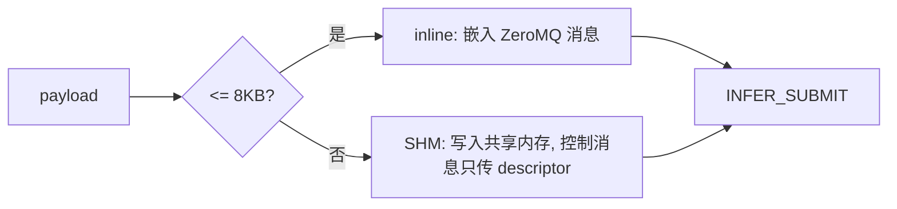

# Nerva 功能设计

更新时间：2026-03-12

本文按模块展开 Nerva 的功能实现，重点解释每个模块的设计动机、关键数据结构和模块间的交互方式。建议先读完《架构设计》再看这篇——那篇讲"为什么这么分层"，这篇讲"每层具体怎么实现的"。

## 1. 从一次调用看模块分工

一个典型的多模型推理请求会依次经过六个模块。用一个具体例子来看它们各自做了什么：

```python
text_enc = model("text_enc", TextEncoderModel, backend="pytorch", device="cpu")
img_enc  = model("img_enc", ImageEncoderModel, backend="pytorch", device="cuda:0")
fusion   = model("fusion", FusionModel, backend="pytorch", device="cuda:1")

def pipeline(inp):
    t, i = parallel(
        lambda: text_enc({"text": inp["text"]}),
        lambda: img_enc({"image": inp["image"]}),
    )
    return fusion({"text_feat": t["features"], "img_feat": i["features"]})

graph = trace(pipeline)
app = build_nerva_app({"mm": graph})
```

这段代码背后发生了什么：

| 阶段 | 模块 | 做了什么 |
|---|---|---|
| 定义期 | `model()` | 创建三个 `ModelHandle`——只是声明，不加载模型 |
| 构图期 | `trace()` | 执行 `pipeline` 函数，`ModelHandle.__call__` 返回 `Proxy`，`parallel()` 创建子图。最终产出一个 `Graph`（3 个 Node + 若干 Edge） |
| 启动期 | `build_nerva_app()` | WorkerManager 为每个模型 spawn Worker 进程，Worker 内 Backend 调用 `Model.load()` |
| 请求期 | RpcHandler → Executor | 收到请求后，Executor 按 Graph 拓扑调度：先并行执行 text_enc 和 img_enc，两者都完成后执行 fusion |
| 执行期 | WorkerProxy → WorkerLoop | 每个模型调用通过 ZeroMQ 发到对应 Worker，Worker 内 Backend 调用 `Model.infer()` 返回结果 |
| 响应期 | RpcHandler | 收集 fusion 输出，编码为二进制帧返回客户端 |

下面按这条链路逐模块展开。

## 2. DSL 层：从函数到图

对应代码：`src/nerva/core/`

### 2.1 ModelHandle 的双态设计

`model()` 返回的 `ModelHandle` 是整个 DSL 层的入口。它的关键特性是 **双态**：

- **trace 模式**（`TraceContext` 存在时）：`__call__` 创建一个 `Node`，从输入中提取依赖边（`Edge`），返回一个 `Proxy` 占位对象。
- **非 trace 模式**：`__call__` 抛出 `RuntimeError`。ModelHandle 不直接执行推理——运行时调用走的是 `WorkerProxy.infer()`，不经过 ModelHandle。

这意味着 `ModelHandle` 只在定义期和构图期有作用。运行时它不参与任何逻辑。

### 2.2 Proxy：记录依赖的占位对象

`Proxy` 是 trace 阶段的核心。它代表"某个节点的未来输出"，主要记录两个信息：

- `source_node_id`：哪个节点产出了这个值。pipeline 输入的 Proxy `source_node_id` 为 `None`。
- `_field_path`：`__getitem__` 访问路径。比如 `out["features"]` 产生的 Proxy 的 `_field_path` 是 `("features",)`。

当这个 Proxy 被传给下一个 `ModelHandle.__call__` 时，`_extract_proxy_edges()` 会从中提取 `Edge`：

- `edge.src` = Proxy 的 `source_node_id`
- `edge.src_field_path` = Proxy 的 `_field_path`
- `edge.dst_input_key` = 如果输入是 dict，则为 dict 的 key

这套机制让用户写 `fusion({"text_feat": t["features"]})` 时，框架自动知道 fusion 节点依赖 text_enc 节点的 `features` 字段。

### 2.3 trace() 的工作过程

`trace(fn)` 的逻辑很直接：

1. 创建 `TraceContext`，设置到 `ContextVar`。
2. 构造输入 `Proxy`（`source_node_id=None`，代表 pipeline 外部输入）。
3. 调用 `fn(input_proxy)`。函数内部的所有 `ModelHandle.__call__` 会在 TraceContext 中注册 Node 和 Edge。
4. 返回 `ctx.graph`。

`ContextVar` 的使用保证了并发 trace（比如在不同 asyncio task 中）互不干扰。

### 2.4 cond() 和 parallel() 的子图嵌入

`cond()` 和 `parallel()` 不是简单的函数调用——它们在父图中创建控制流节点，同时把分支逻辑 trace 成独立的子图（`Graph`）挂在节点上。

```
parallel(lambda: a(x), lambda: b(x))
```

这行代码做了什么：
1. 临时切换 `TraceContext.graph` 到一个新的空 `Graph`。
2. 执行第一个 lambda，trace 出分支子图 A。
3. 同样 trace 出分支子图 B。
4. 恢复父 `Graph`，在其中添加一个 `node_type="parallel"` 的 Node，`branches=[子图A, 子图B]`。

运行时，Executor 遇到 `parallel` 节点时，为每个子图创建一个子 Executor 并发执行。`cond` 节点则先求值 predicate，再只执行命中的分支。

### 2.5 改动注意

- `Proxy._field_path` 和 `Edge.dst_input_key` 的语义必须保持一致。前者记录"从上游输出的哪个字段取值"，后者记录"放到下游输入的哪个 key"。两者对不上就会在运行时拿错数据。
- `cond`/`parallel` 的分支 lambda 捕获上游 Proxy 时，子图中的边必须正确指向父图的节点。这是历史高风险点（`R-PH2-PROXY-CAPTURE`）。

## 3. 执行层：图的调度与执行

对应代码：`src/nerva/engine/`

### 3.1 Executor 的事件驱动调度

`Executor.execute()` 的核心数据结构是三个：

- `in_degree: dict[str, int]` — 每个节点的当前入度。
- `done_queue: asyncio.Queue` — 已完成节点的 ID（或异常对象）。
- `completed: dict[str, Any]` — 已完成节点的输出缓存。

调度循环：入度为 0 → create_task → 节点完成 → done_queue → 后继入度减 1 → 入度为 0 的后继立即调度。

这里有一个设计选择：当节点失败时，Executor 不是等所有节点跑完再汇总错误，而是立即 `break` 出循环，取消所有 running tasks。这是 **fail-fast** 语义——一个节点挂了，整个 DAG 就挂了，不浪费资源在注定失败的请求上。

### 3.2 输入组装：三种模式

`_build_node_inputs()` 根据入边情况决定怎么组装节点输入，逻辑有三种分支：

| 条件 | 行为 | 典型场景 |
|---|---|---|
| 无入边 | 直接透传 pipeline 原始输入 | DAG 的 source 节点 |
| 多条入边，每条都有 `dst_input_key` | 按 key 组装 dict | `fusion({"text": t, "img": i})` |
| 单条入边，无 key | 透传上游输出（可含 field_path 提取） | `b(a(x))` 线性链 |

第二种模式是最常用的。field_path 提取发生在组装时：`resolve_field_path(output, edge.src_field_path)` 沿路径逐层取值。

这块是常见 bug 来源——改动前建议先跑 `tests/test_executor.py` 和 `tests/test_dag_executor_e2e.py` 确认基线。

### 3.3 DynamicBatcher

`DynamicBatcher` 包装在 `WorkerProxy.infer()` 外面，对 Executor 透明。它的职责：

1. **聚合短窗口请求**：在 `max_delay_ms`（默认 10ms）内收集同模型的请求，凑够 `max_batch_size` 或等待超时后统一提交。
2. **Deadline 感知**：请求进入 batcher 时检查 deadline 残余时间，不足以等到下一个 batch flush 的直接拒绝。
3. **Queue backpressure**：队列深度达到 `queue_capacity` 时返回 `RESOURCE_EXHAUSTED`。

S4 spike（`docs/spikes/s4-async-batcher-report.md`）的数据显示，`max_batch_size` 是最重要的吞吐旋钮：batch=32 相比 batch=8 在高并发下带来约 2× 吞吐提升。`max_delay_ms` 在低并发时影响大（delay=1 vs delay=10 相差 2.3 倍），高并发时影响可忽略（仅 3.6%）。

特殊情况：vLLM Backend 自带 continuous batching，Nerva 的 DynamicBatcher 旁路 vLLM 节点——只控制入队和 deadline，不干预 vLLM 内部的 token-level 调度。

## 4. Worker 层：进程隔离的实现

对应代码：`src/nerva/worker/`、`src/nerva/engine/shm_pool.py`

### 4.1 三个角色的分工

Worker 层有三个组件，各自职责明确：

| 组件 | 运行位置 | 职责 |
|---|---|---|
| **WorkerManager** | Master 进程 | Worker 生命周期全管：spawn、健康检查、重启、关停、资源清理 |
| **WorkerProxy** | Master 进程 | 单个 Worker 的 RPC 代理。提供 `infer()`、`cancel()`、`health_check()` 等 async 接口 |
| **WorkerLoop** (`_WorkerLoop`) | Worker 子进程 | 消息循环。监听 ZeroMQ 通道，按消息类型分发到 Backend |

调用关系：`Executor` → `WorkerProxy.infer()` → ZeroMQ → `_WorkerLoop` → `Backend.infer()` → `Model.infer()`

### 4.2 IPC 消息类型

WorkerProxy 和 WorkerLoop 之间通过 ZeroMQ PAIR 通道交换以下消息（msgpack 编码）：

| 消息 | 方向 | 用途 |
|---|---|---|
| `LOAD_MODEL` | Master → Worker | 加载模型（启动时） |
| `INFER_SUBMIT` | Master → Worker | 提交推理请求 |
| `INFER_ACK` | Worker → Master | 返回推理结果 |
| `CANCEL` | Master → Worker | 取消指定 request_id 的请求 |
| `SHM_ALLOC_RESPONSE` | Master → Worker | 回应 Worker 的 SHM 槽位申请 |
| `SHUTDOWN` | Master → Worker | 优雅关闭 |

**request_id 必须唯一**。WorkerProxy 内部维护 `pending: dict[str, Future]` 映射。重复的 request_id 会覆盖已有的 Future，导致之前的请求永远 hang 住。

### 4.3 SHM 池：slab + size classes

共享内存池（`ShmPool`）在启动时预分配一块 POSIX shared memory，按 size class 划分 slab。当前不做运行时动态扩容——SHM 满时快速失败，返回 `RESOURCE_EXHAUSTED`。

这个选择看起来保守，但有明确的工程理由：

- **上界可预测**：运维能提前知道最坏情况下的内存占用。
- **无泄漏保证**：配合 lifetime_token + timeout GC + 进程崩溃后的批量回收，可以保证 SHM slot 不会长期泄漏。
- **简化调试**：SHM 满是一个清晰的信号（指标可观测），比"SHM 在某个不确定的时刻动态扩容后 OOM"更容易排查。

### 4.4 数据路径选择



Descriptor 字段包括：
- `shm_id` / `offset` / `length`：SHM 路径
- `inline_data`：inline 路径
- `payload_codec`：`msgpack_dict_v1`（默认）或 `raw_bytes_v1`（单字段 bytes 快速路径，跳过 dict 级 msgpack 编解码）
- `field_path`：结构化输出的解析路径

## 5. 服务层：协议与请求治理

对应代码：`src/nerva/server/`

### 5.1 两个入口

- **`build_nerva_app(pipelines)`**：返回 ASGI app，推荐在托管模式下使用（`uvicorn your_module:app`）。支持 ASGI lifespan 协议——启动时 spawn Workers，关闭时清理。
- **`serve(pipelines, host, port)`**：阻塞启动，内部调用 `build_nerva_app` + `uvicorn.run`。适合快速验证。

Pipeline 和 Serving 是分离的。`Graph` 本身可以独立执行（通过 Executor + WorkerManager），不依赖 HTTP 层。这让单元测试和嵌入式使用不需要启动服务。

### 5.2 Binary RPC 帧格式

每个帧由 32 字节固定头 + 可变长 payload 组成：

| 字段 | 大小 | 说明 |
|---|---:|---|
| magic | 2B | `0x4E56`（"NV"） |
| version | 1B | 协议版本（当前为 1） |
| type | 1B | `OPEN(1)` / `DATA(2)` / `END(3)` / `ERROR(4)` / `HEARTBEAT(5)` |
| flags | 2B | 位标记 |
| reserved | 2B | 保留 |
| request_id | 8B | 请求关联 ID |
| stream_id | 4B | 流 ID（当前固定为 1） |
| payload_len | 4B | payload 字节数 |
| crc32 | 4B | 校验（当前填 0，头字段已预留） |
| header_ext_len | 4B | 扩展头长度（当前为 0） |

version 不匹配时直接返回 `INVALID_ARGUMENT` 并关闭连接，不做隐式兼容。

### 5.3 RpcHandler 的职责链

`RpcHandler` 处理一个请求的流程：

1. **帧解析**：读取二进制帧头，校验 magic/version/type。
2. **Header 校验**：检查 `x-nerva-request-id`（必须存在）、`x-nerva-deadline-ms`。
3. **Deadline 转换**：绝对时间戳转为相对 TTL。
4. **Pipeline 查找**：根据 URL 中的 pipeline 名称查找对应的 Graph 和 WorkerProxy 集合。
5. **执行**：创建 Executor，调用 `execute(inputs, context)`。
6. **异常映射**：捕获异常，映射为 RPC 错误码。
7. **指标记录**：请求计数、延迟分布、错误分类。

### 5.4 错误码

| 错误码 | 值 | 含义 |
|---|---|---|
| `INVALID_ARGUMENT` | 3 | 协议或参数问题（帧格式错、pipeline 不存在） |
| `DEADLINE_EXCEEDED` | 4 | 请求超时或到达时已过期 |
| `RESOURCE_EXHAUSTED` | 8 | 资源不足（队列满、SHM 满） |
| `INTERNAL` | 13 | 未分类内部错误 |

错误码沿用 gRPC 的 subset，这样客户端的重试逻辑可以复用业界通用的语义（比如 `RESOURCE_EXHAUSTED` 通常建议退避重试，`INVALID_ARGUMENT` 不重试）。

## 6. Backend 层：模型执行抽象

对应代码：`src/nerva/backends/`

### 6.1 Backend ABC

`Backend` 定义了模型执行后端的统一生命周期接口：

| 方法 | 调用时机 | 职责 |
|---|---|---|
| `load_model(config)` | Worker 启动期 | 实例化用户 Model，调用 `Model.load()`，分配运行时资源 |
| `unload_model()` | Worker 关停期 | 调用 `Model.unload()`，释放资源 |
| `infer(inputs, context, batch_meta)` | 每次推理 | 调用 `Model.infer()`，处理 context（deadline、cancel）和 batch_meta |
| `infer_stream(inputs, context)` | 流式推理（后续扩展） | 返回 async iterator |

Backend 和 Model 的职责边界（设计评审 P0-1）：

- **Model** 是用户自定义的预测节点——只关心"给什么输入、返回什么输出"。用户实现 `load()` 和 `infer()`。
- **Backend** 是框架的执行后端——负责 Model 的生命周期管理、batch 拼接/拆分、异常处理、指标采集。用户不需要直接接触 Backend。

### 6.2 内置实现

**PyTorchBackend**：直接承接用户 Model。`infer()` 调用 `Model.infer(inputs)`，没有额外的框架逻辑。适用于所有非 vLLM 场景。

**VLLMBackend**：面向文本生成场景。`load_model()` 时启动 vLLM 的 `AsyncLLMEngine`，`infer()` 把请求提交给 vLLM 的内部调度器。关键区别：vLLM 自带 continuous batching，Nerva 不重复做 batch 管理——DynamicBatcher 旁路 vLLM 节点。

### 6.3 自定义 Backend 示例

实现一个最小的自定义 Backend：

```python
from typing import Any

from nerva.backends.base import Backend, BatchMeta, InferContext, ModelConfig


class EchoBackend(Backend):
    def __init__(self) -> None:
        self._loaded = False

    async def load_model(self, config: ModelConfig) -> None:
        self._loaded = True

    async def unload_model(self) -> None:
        self._loaded = False

    async def infer(
        self,
        inputs: dict[str, Any],
        context: InferContext,
        batch_meta: BatchMeta | None = None,
    ) -> dict[str, Any]:
        if not self._loaded:
            raise RuntimeError("model not loaded")
        if context.cancelled:
            raise RuntimeError("request cancelled")
        return {"echo": inputs}

    async def infer_stream(self, inputs: dict[str, Any], context: InferContext):
        yield {"echo": inputs}
```

注册和使用：

```python
from nerva.backends.registry import register_backend

register_backend("echo")(EchoBackend)
echo = model("echo", EchoModel, backend="echo", device="cpu")
```

## 7. 可观测层

对应代码：`src/nerva/observability/`

- **指标容器**：`NervaMetrics`，基于 prometheus_client。每个指标按 `pipeline`、`model`、`status` 等维度打标。
- **日志**：`configure_logging` 配置 structlog 结构化日志。每条日志绑定 `request_id` 和 `pipeline` 上下文。

实操建议：把指标波动（比如 `queue_depth` 抬升）和同一 `request_id` 的日志放在一起看，能快速缩小排障范围。单看指标知道"慢了"，但看日志才能知道"为什么慢"。

## 8. 扩展指南

### 8.1 新增 Backend

1. 实现 `Backend` ABC，注册到 registry（`@register_backend("name")`）。
2. 在 `tests/` 下补对应 backend 的单元测试。
3. 用 `model(..., backend="name")` 走通最小链路。

### 8.2 新增控制流原语

1. 在 `core/primitives.py` 定义 trace 语义（如何创建节点和子图）。
2. 在 `Executor` 中实现 runtime 解释（如何调度和执行）。
3. 补图层 + 执行层回归测试。注意：新原语的子图边界处理是高风险区域，需要同时覆盖正常路径和边界情况。

### 8.3 新增服务治理逻辑

1. 先判断逻辑属于入口层（RpcHandler）还是执行层（Executor）。入口层的改动影响所有请求；执行层的改动可能只影响特定 pipeline。
2. 若改协议字段，先补协议层测试（`tests/test_protocol.py`）。
3. 至少补一条 RPC 单测（`tests/test_rpc.py`）和一条 E2E 测试（`tests/test_server_rpc_e2e.py`）。
