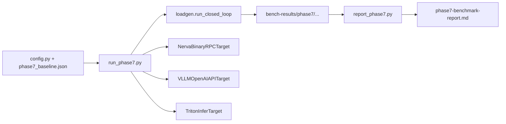
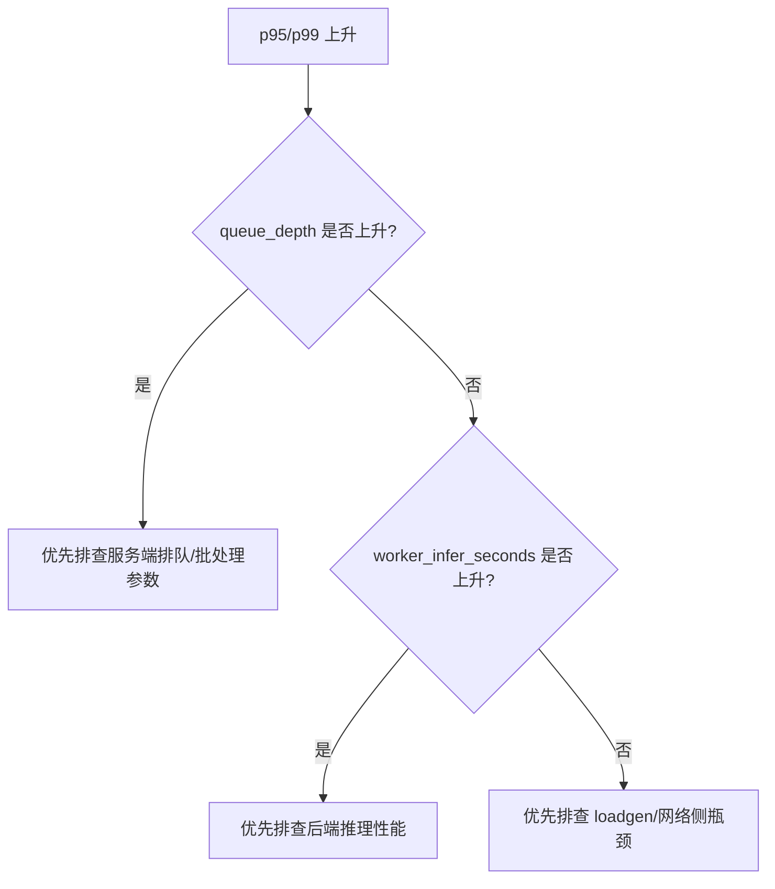

# Nerva 性能测试指南

更新时间：2026-03-03

口径说明：本文聚焦本仓库已落地的性能工具链（Phase 2 + Phase 7），目标是给出可复现、可对比、可归因的测试方法。

## 1. 先看目标：我们到底在测什么

Nerva 的性能测试不只是“跑个 QPS 数字”，而是回答三个问题：

1. 当前吞吐和延迟处在什么水平。
2. 瓶颈在客户端、服务编排层，还是后端执行层。
3. 新改动是否带来可解释的收益或退化。

因此，性能文档强调“统一口径 + 可复现产物 + 指标联动分析”。

## 2. 两条性能测试线

### 2.1 Phase 2：框架内核基准（pytest slow）

- B1：`trace()` 构图开销。
- B2：`Executor` 调度开销。
- B3：`parallel` 并行收益。
- B4：端到端 pipeline（小/大 payload）。

适用场景：改动 `core/engine` 后，快速评估框架内核是否退化。

### 2.2 Phase 7：端到端对照压测

- 对照目标：`nerva`、`vllm`、`triton`。
- 统一矩阵：并发档位包含 `1,32,128,512,1000`。
- 统一产物：`summary.json`、`raw-latency.csv`、`run-meta.json`。

适用场景：做系统级对比或优化验收。

## 3. 工具链结构



关键文件：
- `scripts/bench/run_phase7.py`：测试矩阵执行与产物落盘。
- `scripts/bench/loadgen.py`：闭环并发负载引擎。
- `scripts/bench/targets/*.py`：目标系统适配器。
- `scripts/bench/report_phase7.py`：汇总报告生成。

## 4. 执行前准备（很关键）

为了结果可比，建议在每次正式跑测前记录：
- 代码 commit。
- 机器规格（CPU、内存、GPU、驱动）。
- 关键参数（并发矩阵、warmup/sample 时长、deadline）。
- 服务版本与启动参数。

如果以上信息缺失，后续“为什么变快/变慢”很难解释。

## 5. 本地执行步骤（Phase 7）

### 5.1 启动 Nerva 服务

```bash
uv run uvicorn examples.phase7_multimodal_vllm_server:app --host 127.0.0.1 --port 8080
```

### 5.2 启动 Native vLLM

```bash
uv run python scripts/bench/infra/start_vllm_server.py \
  --model <MODEL_PATH> \
  --host 127.0.0.1 \
  --port 8001

uv run python scripts/bench/infra/wait_service_ready.py \
  --kind vllm \
  --url http://127.0.0.1:8001/health \
  --timeout-seconds 120
```

### 5.3 启动 Triton

```bash
uv run python scripts/bench/infra/prepare_triton_repo.py --output /tmp/phase7-triton-repo

uv run python scripts/bench/infra/start_triton_server.py \
  --model-repo /tmp/phase7-triton-repo \
  --http-port 8002 \
  --grpc-port 8003 \
  --metrics-port 8004

uv run python scripts/bench/infra/wait_service_ready.py \
  --kind triton \
  --url http://127.0.0.1:8002/v2/health/ready \
  --timeout-seconds 120
```

### 5.4 先跑冒烟再跑全量

冒烟（低成本验证链路可用）：

```bash
uv run python scripts/bench/run_phase7.py \
  --target nerva --target vllm --target triton \
  --concurrency-levels 1,32 \
  --warmup-seconds 10 \
  --sample-seconds 30
```

全矩阵（正式采样）：

```bash
uv run python scripts/bench/run_phase7.py \
  --target nerva --target vllm --target triton \
  --concurrency-levels 1,32,128,512,1000 \
  --warmup-seconds 60 \
  --sample-seconds 300
```

### 5.5 生成汇总文档

```bash
uv run python scripts/bench/report_phase7.py \
  --input-root bench-results/phase7 \
  --output docs/plans/phase7-benchmark-report.md
```

## 6. 本地执行步骤（Phase 2）

```bash
uv run pytest tests/test_phase2_bench.py -m slow -v -s
```

建议在以下改动后执行：
- `trace/proxy/graph` 相关改动。
- `Executor` 调度改动。
- `parallel/cond` 执行语义改动。

## 7. 产物结构与字段解释

### 7.1 目录结构

```text
bench-results/phase7/<date>/<commit>/<target>/<concurrency>/
```

### 7.2 文件含义

- `summary.json`：核心指标摘要。
- `raw-latency.csv`：原始延迟样本，用于分布分析。
- `run-meta.json`：运行元信息（endpoint、deadline、时长、commit）。

### 7.3 指标解释建议

- `qps`：吞吐水平，先看趋势再看绝对值。
- `p50_ms`：常态延迟。
- `p95_ms` / `p99_ms`：尾延迟，最能反映排队与抖动问题。
- `error_rate`：稳定性底线指标，高并发下尤其关键。

## 8. 在线指标联动排查

除离线产物外，建议同时抓 `GET /metrics`：

```bash
curl http://127.0.0.1:8080/metrics
```

重点关注：
- `nerva_request_in_flight`
- `nerva_queue_depth`
- `nerva_batch_wait_seconds`
- `nerva_worker_infer_seconds`

经验上：
- 若 `queue_depth` 持续上升且 `p95/p99` 抖动，常见是服务侧排队压力。
- 若 `worker_infer_seconds` 上升明显，常见是后端推理耗时变长。
- 若客户端 CPU 飙高但服务指标平稳，常见是 loadgen 先饱和。



## 9. 如何新增性能测试

### 9.1 新增 Phase 7 目标（target adapter）

1. 在 `scripts/bench/targets/` 新建适配器，实现 `infer(payload, deadline_ms)`。
2. 返回统一 `TargetResponse` 结构。
3. 在 `run_phase7.py` 扩展 `--target` 参数和构建分发逻辑。
4. 在 `tests/test_phase7_targets.py` 增加契约与异常测试。

### 9.2 新增 Phase 7 workload

1. 在 `run_phase7.py` 扩展 `_payload_for_target` 分支。
2. 确保各 target 输入语义对齐。
3. 增加配置样例与对应测试，避免“只改脚本不改契约”。

### 9.3 新增 Phase 2 基准项

1. 在 `tests/test_phase2_bench.py` 增加 `@pytest.mark.slow` 用例。
2. 延续现有产物字段，保证历史可比。
3. 补环境和参数记录，避免基线不可复现。

## 10. 常见问题

- 现象：并发到 1000 时跑不满。
- 建议：先确认 loadgen 端资源，再看服务端指标，不要只看 QPS。

- 现象：不同天跑出来波动很大。
- 建议：固定硬件、固定模型、固定矩阵、固定时长；并记录 commit。

- 现象：误把 mock 数据当正式结果。
- 建议：正式报告前检查 `run-meta.json`，确保不是 mock 路径。

## 11. 交付标准（性能改动）

对于性能相关 PR，建议至少包含：
- 一组可复现实测数据（与基线对比）。
- 关键指标解释（吞吐、尾延迟、错误率）。
- `/metrics` 观察结论与 `request_id` 相关日志证据。

