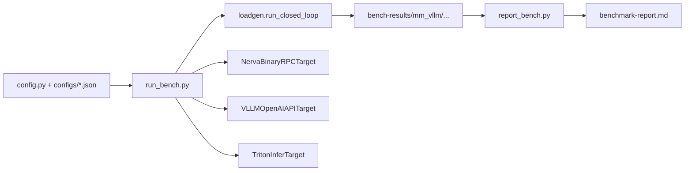
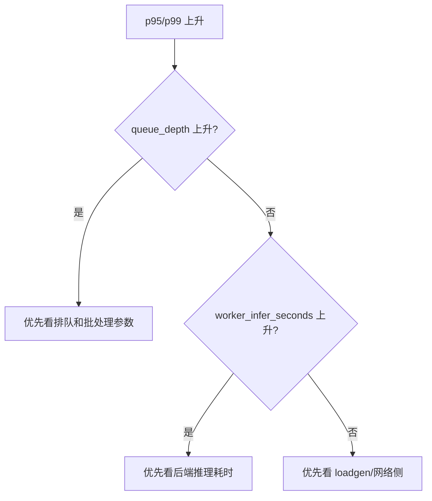

# Nerva 性能测试指南

更新时间：2026-03-11

## 1. 我们在测什么

Nerva 的性能测试不是只看 QPS。更关键的是三点：
- 吞吐和延迟现在处在什么水平。
- 瓶颈是在客户端、编排层，还是后端执行层。
- 一次优化到底是有效，还是只是换了测试条件。

## 2. 当前两条测试线

### 2.1 框架内核基准测试（tests/test_dag_bench.py）

对应 `tests/test_dag_bench.py`，包含：
- B1：`trace()` 构图开销。
- B2：`Executor` 调度开销。
- B3：`parallel` 并行收益。
- B4：端到端 pipeline（小/大 payload）。

适合在你修改 `core/engine` 时评估框架侧性能影响。

### 2.2 端到端多目标对照测试（scripts/bench/run_bench.py）

通过 `scripts/bench/run_bench.py` 对照三类目标：
- `nerva`
- `vllm`
- `triton`

默认并发矩阵：`1,32,128,512,1000`。默认 image payload：64 KB（可通过 `--image-size-bytes` 调整）。

## 3. 工具链



关键脚本：
- `scripts/bench/run_bench.py`：执行矩阵并写产物。
- `scripts/bench/loadgen.py`：闭环并发负载器。
- `scripts/bench/targets/*.py`：不同服务协议的适配器。
- `scripts/bench/report_bench.py`：把产物汇总成报告。
- `scripts/bench/sweep_instances_concurrency.py`：instance_count × concurrency 参数扫描（见第 6 节）。
- `scripts/bench/infra/prepare_triton_repo.py`：生成 Triton CPU mock model repo（支持 pre/post latency 和 instance_count 配置）。
- `scripts/bench/infra/perf_compare_scenario.py`：多场景对比编排（Triton in-process vs. baseline 等）。

## 4. 正式跑测前要固定的条件

建议每次都记录：
- commit hash。
- 机器规格（CPU、内存、GPU）。
- 并发、warmup、sample、deadline、image-size-bytes。
- 服务启动参数（模型路径、TP 数、GPU mem util）。

这部分如果没记录，后续很难解释"为什么这次快了/慢了"。

## 5. 端到端多目标对照测试执行步骤

### 5.1 启动 Nerva

```bash
MM_VLLM_MODEL_PATH=<MODEL_PATH> \
uv run uvicorn examples.mm_vllm_server:app --host 127.0.0.1 --port 8080
```

### 5.2 启动 vLLM

```bash
uv run python scripts/bench/infra/start_vllm_server.py \
  --model <MODEL_PATH> \
  --host 127.0.0.1 \
  --port 8001

uv run python scripts/bench/infra/wait_service_ready.py \
  --kind vllm \
  --url http://127.0.0.1:8001/health \
  --timeout-seconds 120
```

### 5.3 启动 Triton

Triton ensemble 内嵌 vLLM（in-process AsyncLLMEngine），不再需要单独启动 vLLM：

```bash
uv run python scripts/bench/infra/prepare_triton_repo.py \
  --output /tmp/mm_vllm-triton-repo \
  --vllm-model <MODEL_PATH>

uv run python scripts/bench/infra/start_triton_server.py \
  --model-repo /tmp/mm_vllm-triton-repo \
  --http-port 8002 \
  --grpc-port 8003 \
  --metrics-port 8004

uv run python scripts/bench/infra/wait_service_ready.py \
  --kind triton \
  --url http://127.0.0.1:8002/v2/health/ready \
  --timeout-seconds 300
```

### 5.4 先冒烟，再全量

冒烟：

```bash
uv run python scripts/bench/run_bench.py \
  --target nerva --target vllm --target triton \
  --concurrency-levels 1,32 \
  --warmup-seconds 10 \
  --sample-seconds 30
```

全量：

```bash
uv run python scripts/bench/run_bench.py \
  --target nerva --target vllm --target triton \
  --concurrency-levels 1,32,128,512,1000 \
  --warmup-seconds 60 \
  --sample-seconds 300 \
  --image-size-bytes 65536
```

若要确保跑真实后端（非 mock），加 `--require-real-backend`：

```bash
uv run python scripts/bench/run_bench.py \
  --target nerva --target vllm --target triton \
  --concurrency-levels 1,32,128,512,1000 \
  --warmup-seconds 60 \
  --sample-seconds 300 \
  --require-real-backend
```

### 5.5 生成汇总报告

```bash
uv run python scripts/bench/report_bench.py \
  --input-root bench-results \
  --output docs/plans/benchmark-report.md
```

## 6. Instance × Concurrency 参数扫描

对于需要系统性分析 pre/post 实例数与并发度关系的场景，使用
`scripts/bench/sweep_instances_concurrency.py` 自动化扫描。

### 6.1 脚本功能

- 顺序遍历每个 `(target, instances)` 组合，自动启停服务
- 每个服务实例内对所有 C 级别批量压测（`run_bench.py` 单次调用）
- 结果写入各自子目录，并汇总至 `summary.csv`
- 支持 `--skip-existing` 断点续跑

### 6.2 常用命令

```bash
# 完整扫描（instances 1-10，C=1/4/8/16/32/64/100）
# 预估时间：10 × (20+30)s × 7级 × 2 target ≈ 3.5 小时
uv run python scripts/bench/sweep_instances_concurrency.py \
  --target nerva triton \
  --warmup-seconds 20 \
  --sample-seconds 30

# 快速验证（少量组合）
uv run python scripts/bench/sweep_instances_concurrency.py \
  --target nerva triton \
  --instances 1 2 3 5 \
  --concurrency-levels 8,32,100 \
  --warmup-seconds 15 \
  --sample-seconds 20

# 仅跑 Nerva，断点续跑
uv run python scripts/bench/sweep_instances_concurrency.py \
  --target nerva \
  --skip-existing
```

### 6.3 环境变量控制

Nerva mock server 通过环境变量控制 pre/post 实例数（sweep 脚本自动注入）：

```bash
# 手动启动时
NERVA_PRE_POST_INSTANCES=3 uv run uvicorn \
  examples.mm_vllm_cpu_mock_server:app \
  --host 0.0.0.0 --port 8080 --workers 3
```

### 6.4 Triton CPU mock 配置

`prepare_triton_repo.py` 支持等价的延迟与实例数配置，确保两侧 pipeline 可对比：

```bash
uv run python scripts/bench/infra/prepare_triton_repo.py \
  --output /private/tmp/triton_repo \
  --cpu-mock \
  --mock-token-latency-ms 0.5 \
  --mock-preprocess-latency-ms 5.0 \
  --mock-postprocess-latency-ms 2.0 \
  --mock-latency-jitter-frac 0.1 \
  --pre-post-instance-count 3
```

**注意**：Triton 容器端口约定（`-p 8001:8000`），压测时需明确指定：
```bash
--triton-url http://127.0.0.1:8001   # 宿主机 8001 = 容器 HTTP 8000
```

### 6.5 产物结构

```
bench-results-sweep/
  nerva/instances_1/mm_vllm/<date>/<commit>/nerva/<C>/summary.json
  nerva/instances_2/...
  triton/instances_1/...
  summary.csv    ← 所有结果汇总，含 target/instances/concurrency 字段
```

---

## 7. 框架内核基准测试执行步骤

```bash
uv run pytest tests/test_dag_bench.py -m slow -v -s
```

建议在这些改动后跑一遍：
- `trace/proxy/graph`
- `Executor`
- `cond/parallel` 执行语义

## 9. 产物与指标怎么读

### 7.1 目录结构

```text
bench-results/mm_vllm/<date>/<commit>/<target>/<concurrency>/
```

### 7.2 文件含义

- `summary.json`：摘要指标（QPS、p50/p95/p99、error_rate）。
- `raw-latency.csv`：原始延迟数据。
- `run-meta.json`：运行参数与元信息（含 image_size_bytes、backend_mode 等）。

### 7.3 重点指标

- `qps`：吞吐。
- `p95/p99`：尾延迟。
- `error_rate`：稳定性底线。

对比时尽量同时看这三项，不要只盯一个数。

### 7.4 backend_mode 字段

`run-meta.json` 的 `backend_mode` 记录目标服务是否运行真实推理：
- `real`：真实后端（GPU 推理）。
- `mock`：mock 模式（HTTP stub，不执行真实推理）。
- `unknown`：健康检查未返回 backend 信息。

报告中若混入 mock 数据，对比结论无效。

## 10. 联动 `/metrics` 做定位

```bash
curl http://127.0.0.1:8080/metrics
```

优先关注：
- `nerva_request_in_flight`
- `nerva_queue_depth`
- `nerva_batch_wait_seconds`
- `nerva_worker_infer_seconds`

经验判断：
- `queue_depth` 持续抬高且 p95/p99 变差，多半是服务侧排队压力。
- `worker_infer_seconds` 上升明显，多半是后端推理变慢。
- 客户端 CPU 打满但服务指标平稳，多半是 loadgen 先到瓶颈。



## 11. 如何扩展性能测试

### 9.1 新增对照目标（target）

1. 在 `scripts/bench/targets/` 新建适配器，实现 `BenchTarget` 协议。
2. 保持 `TargetResponse` 契约一致。
3. 在 `run_bench.py` 的 `_build_target_from_args` 和 `--target choices` 扩展。
4. 在 `tests/test_bench_targets.py` 补契约测试。

### 9.2 新增压测负载（workload）

1. 扩展 `_payload_for_target` / `_mm_vllm_source_input`。
2. 保证不同 target 的输入语义一致。
3. 补配置样例和测试，避免"脚本支持了但测试没覆盖"。

### 9.3 新增内核基准项

1. 在 `tests/test_phase2_bench.py` 增加 `@pytest.mark.slow` 用例。
2. 沿用现有产物字段，方便历史对比。

## 12. 常见坑

- **高并发打不满**：先排查 loadgen 端资源（CPU、文件描述符），再看服务端。
- **同一命令结果波动大**：检查硬件、模型、时长、并发、image-size-bytes 是否一致。
- **报告混入 mock 数据**：检查 `run-meta.json` 的 `backend_mode` 字段。
- **Triton 启动超时**：in-process vLLM 首次加载模型较慢，`--timeout-seconds` 建议设 300 以上。
- **base64 overhead**：Triton HTTP/REST 协议中 BYTES tensor 通过 base64 传输，64 KB 图片实际 wire size 约 88 KB，这是协议约定，不是 bug。

## 13. 性能改动的交付建议

性能相关 PR 最好同时给三样东西：
- 与基线的对比数据（`summary.json` 或 `benchmark-report.md`）。
- 关键指标解释（吞吐、尾延迟、错误率）。
- `/metrics` 与日志链路证据（区分编排层 vs. 推理层耗时）。
