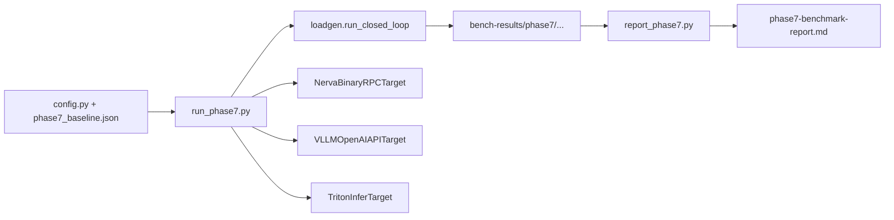
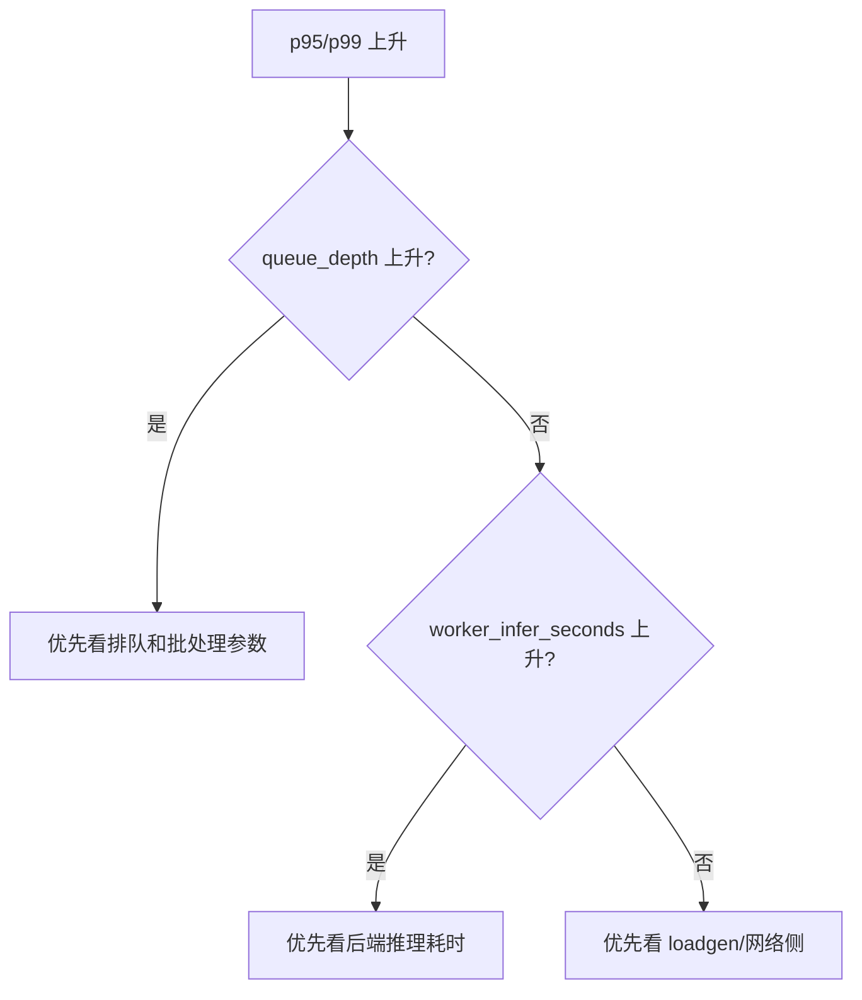

# Nerva 性能测试指南

更新时间：2026-03-03

## 1. 我们在测什么

Nerva 的性能测试不是只看 QPS。更关键的是三点：
- 吞吐和延迟现在处在什么水平。
- 瓶颈是在客户端、编排层，还是后端执行层。
- 一次优化到底是有效，还是只是换了测试条件。

## 2. 当前两条测试线

### 2.1 框架内核基准测试（tests/test_phase2_bench.py）

对应 `tests/test_phase2_bench.py`，包含：
- B1：`trace()` 构图开销。
- B2：`Executor` 调度开销。
- B3：`parallel` 并行收益。
- B4：端到端 pipeline（小/大 payload）。

适合在你修改 `core/engine` 时评估框架侧性能影响。

### 2.2 端到端多目标对照测试（scripts/bench/run_phase7.py）

通过 `scripts/bench/run_phase7.py` 对照三类目标：
- `nerva`
- `vllm`
- `triton`

默认并发矩阵：`1,32,128,512,1000`。

## 3. 工具链



关键脚本：
- `scripts/bench/run_phase7.py`：执行矩阵并写产物。
- `scripts/bench/loadgen.py`：闭环并发负载器。
- `scripts/bench/targets/*.py`：不同服务协议的适配器。
- `scripts/bench/report_phase7.py`：把产物汇总成报告。

## 4. 正式跑测前要固定的条件

建议每次都记录：
- commit hash。
- 机器规格（CPU、内存、GPU）。
- 并发、warmup、sample、deadline。
- 服务启动参数。

这部分如果没记录，后续很难解释“为什么这次快了/慢了”。

## 5. 端到端多目标对照测试执行步骤

### 5.1 启动 Nerva

```bash
uv run uvicorn examples.phase7_multimodal_vllm_server:app --host 127.0.0.1 --port 8080
```

### 5.2 启动 vLLM

```bash
uv run python scripts/bench/infra/start_vllm_server.py \
  --model <MODEL_PATH> \
  --host 127.0.0.1 \
  --port 8001

uv run python scripts/bench/infra/wait_service_ready.py \
  --kind vllm \
  --url http://127.0.0.1:8001/health \
  --timeout-seconds 120
```

### 5.3 启动 Triton

```bash
uv run python scripts/bench/infra/prepare_triton_repo.py --output /tmp/phase7-triton-repo

uv run python scripts/bench/infra/start_triton_server.py \
  --model-repo /tmp/phase7-triton-repo \
  --http-port 8002 \
  --grpc-port 8003 \
  --metrics-port 8004

uv run python scripts/bench/infra/wait_service_ready.py \
  --kind triton \
  --url http://127.0.0.1:8002/v2/health/ready \
  --timeout-seconds 120
```

### 5.4 先冒烟，再全量

冒烟：

```bash
uv run python scripts/bench/run_phase7.py \
  --target nerva --target vllm --target triton \
  --concurrency-levels 1,32 \
  --warmup-seconds 10 \
  --sample-seconds 30
```

全量：

```bash
uv run python scripts/bench/run_phase7.py \
  --target nerva --target vllm --target triton \
  --concurrency-levels 1,32,128,512,1000 \
  --warmup-seconds 60 \
  --sample-seconds 300
```

### 5.5 生成汇总报告

```bash
uv run python scripts/bench/report_phase7.py \
  --input-root bench-results/phase7 \
  --output docs/plans/phase7-benchmark-report.md
```

## 6. 框架内核基准测试执行步骤

```bash
uv run pytest tests/test_phase2_bench.py -m slow -v -s
```

建议在这些改动后跑一遍：
- `trace/proxy/graph`
- `Executor`
- `cond/parallel` 执行语义

## 7. 产物与指标怎么读

### 7.1 目录结构

```text
bench-results/phase7/<date>/<commit>/<target>/<concurrency>/
```

### 7.2 文件含义

- `summary.json`：摘要指标（QPS、p50/p95/p99、error_rate）。
- `raw-latency.csv`：原始延迟数据。
- `run-meta.json`：运行参数与元信息。

### 7.3 重点指标

- `qps`：吞吐。
- `p95/p99`：尾延迟。
- `error_rate`：稳定性底线。

对比时尽量同时看这三项，不要只盯一个数。

## 8. 联动 `/metrics` 做定位

```bash
curl http://127.0.0.1:8080/metrics
```

优先关注：
- `nerva_request_in_flight`
- `nerva_queue_depth`
- `nerva_batch_wait_seconds`
- `nerva_worker_infer_seconds`

经验判断：
- `queue_depth` 持续抬高且 p95/p99 变差，多半是服务侧排队压力。
- `worker_infer_seconds` 上升明显，多半是后端推理变慢。
- 客户端 CPU 打满但服务指标平稳，多半是 loadgen 先到瓶颈。



## 9. 如何扩展性能测试

### 9.1 新增对照目标（target）

1. 在 `scripts/bench/targets/` 新建适配器。
2. 保持 `TargetResponse` 契约一致。
3. 在 `run_phase7.py` 扩展 `--target` 分发。
4. 在 `tests/test_phase7_targets.py` 补契约测试。

### 9.2 新增压测负载（workload）

1. 扩展 `_payload_for_target`。
2. 保证不同 target 的输入语义一致。
3. 补配置样例和测试，避免“脚本支持了但测试没覆盖”。

### 9.3 新增内核基准项

1. 在 `tests/test_phase2_bench.py` 增加 `@pytest.mark.slow` 用例。
2. 沿用现有产物字段，方便历史对比。

## 10. 常见坑

- 高并发打不满：先排查 loadgen 端资源，再看服务端。
- 同一命令结果波动大：检查硬件、模型、时长、并发是否一致。
- 报告混入 mock 数据：检查 `run-meta.json` 的运行模式。

## 11. 性能改动的交付建议

性能相关 PR 最好同时给三样东西：
- 与基线的对比数据。
- 关键指标解释（吞吐、尾延迟、错误率）。
- `/metrics` 与日志链路证据。
