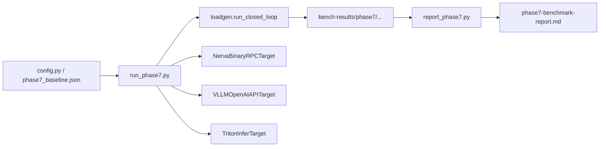

# Nerva 性能测试指南

更新时间：2026-03-03

## 1. 范围与目标

本项目当前有两类性能测试：

- Phase 2：框架内核基准（trace/executor/parallel/e2e，pytest slow）。
- Phase 7：Nerva vs vLLM vs Triton 端到端对照（loadgen + target adapter + 产物落盘）。

目标是统一口径采集 QPS、延迟分位和错误率，并保留可复现产物。

## 2. 性能测试工具链



## 3. 本地执行步骤（Phase 7）

### 3.1 启动 Nerva 服务

```bash
uv run uvicorn examples.phase7_multimodal_vllm_server:app --host 127.0.0.1 --port 8080
```

### 3.2 启动 vLLM 与就绪检查

```bash
uv run python scripts/bench/infra/start_vllm_server.py \
  --model <MODEL_PATH> \
  --host 127.0.0.1 \
  --port 8001

uv run python scripts/bench/infra/wait_service_ready.py \
  --kind vllm \
  --url http://127.0.0.1:8001/health \
  --timeout-seconds 120
```

### 3.3 启动 Triton 与就绪检查

```bash
uv run python scripts/bench/infra/prepare_triton_repo.py --output /tmp/phase7-triton-repo

uv run python scripts/bench/infra/start_triton_server.py \
  --model-repo /tmp/phase7-triton-repo \
  --http-port 8002 \
  --grpc-port 8003 \
  --metrics-port 8004

uv run python scripts/bench/infra/wait_service_ready.py \
  --kind triton \
  --url http://127.0.0.1:8002/v2/health/ready \
  --timeout-seconds 120
```

### 3.4 运行压测矩阵

冒烟：

```bash
uv run python scripts/bench/run_phase7.py \
  --target nerva --target vllm --target triton \
  --concurrency-levels 1,32 \
  --warmup-seconds 10 \
  --sample-seconds 30
```

全矩阵：

```bash
uv run python scripts/bench/run_phase7.py \
  --target nerva --target vllm --target triton \
  --concurrency-levels 1,32,128,512,1000 \
  --warmup-seconds 60 \
  --sample-seconds 300
```

### 3.5 生成汇总报告

```bash
uv run python scripts/bench/report_phase7.py \
  --input-root bench-results/phase7 \
  --output docs/plans/phase7-benchmark-report.md
```

## 4. 本地执行步骤（Phase 2 基准）

```bash
# 只跑慢速 benchmark 用例
uv run pytest tests/test_phase2_bench.py -m slow -v -s
```

该套用例覆盖：
- B1：trace 构图开销。
- B2：executor 调度开销。
- B3：parallel 并行收益。
- B4：端到端 pipeline（小/大 payload）。

## 5. 如何新增性能测试

### 5.1 新增 Phase 7 目标对照（新 target）

1. 在 `scripts/bench/targets/` 新增适配器，实现 `infer(payload, deadline_ms) -> TargetResponse`。
2. 在 `scripts/bench/run_phase7.py` 中扩展 `--target` 选项与 `_build_target_from_args` 分发。
3. 在 `tests/test_phase7_targets.py` 增加解析、错误处理、client 复用等测试。
4. 若有新启动方式，同步 `scripts/bench/infra/` 和 runbook。

### 5.2 新增 Phase 7 工作负载

1. 在 `run_phase7.py` 扩展 `_payload_for_target` 的 workload 分支。
2. 明确三目标输入映射，保证 payload 语义一致。
3. 为新 workload 增加配置样例（JSON）与测试用例。

### 5.3 新增 Phase 2 内核基准

1. 在 `tests/test_phase2_bench.py` 新增 `@pytest.mark.slow` 用例。
2. 沿用现有产物落盘结构与 JSON 字段，保证横向可比性。
3. 明确 warmup、样本数和硬件环境字段，便于复盘。

## 6. 关键性能指标与查看方式

### 6.1 离线压测产物

目录：

```text
bench-results/phase7/<date>/<commit>/<target>/<concurrency>/
```

文件含义：
- `summary.json`：QPS、p50/p95/p99、error_rate、总请求数。
- `raw-latency.csv`：原始延迟样本。
- `run-meta.json`：目标 endpoint、warmup/sample、deadline、commit 等元信息。

### 6.2 在线服务指标

访问：

```bash
curl http://127.0.0.1:8080/metrics
```

重点指标：
- `nerva_request_total`
- `nerva_request_duration_seconds`
- `nerva_request_in_flight`
- `nerva_batch_size`
- `nerva_batch_wait_seconds`
- `nerva_queue_depth`
- `nerva_worker_status`
- `nerva_worker_infer_seconds`

### 6.3 日志链路

- RPC 层会绑定 `request_id` 与 `pipeline`。
- 排障时建议按 `request_id` 串联入口日志、Executor 异常、Worker 异常。

## 7. 常见问题与排查

- 现象：跑不到高并发目标。
- 排查：先看 loadgen 进程 CPU/事件循环是否先饱和，再看服务端指标。

- 现象：大 payload 延迟波动大。
- 排查：确认是否进入 SHM 路径，关注 `queue_depth` 与 `batch_wait_seconds`。

- 现象：对照数据不稳定。
- 排查：固定模型、输入、并发矩阵与采样时长；避免将 mock 结果混入正式报告。

