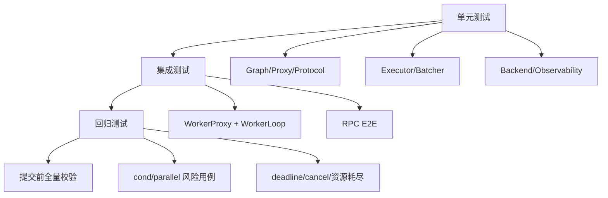

# Nerva 本地测试指南（单元测试 + 集成测试）

更新时间：2026-03-03

这份指南默认你在仓库根目录执行命令。目标只有一个：让改动能在本地稳定复现、稳定回归。

## 1. 测试为什么要分层

Nerva 涉及图语义、异步调度、进程边界和 RPC 协议。只跑一种测试，盲区会很大。

推荐按三层来做：
- 单元测试：看局部逻辑是否正确。
- 集成测试：看模块拼起来是否还能工作。
- 回归测试：盯历史风险点，防止旧问题复发。



## 2. 环境准备

```bash
uv sync --dev
```

如果你需要后端依赖：

```bash
uv sync --dev --extra pytorch
uv sync --dev --extra vllm
```

## 3. 常用检查命令

### 3.1 快速检查（局部改动）

```bash
export PATH="$HOME/.local/bin:$PATH"
uv run ruff check src/ tests/
uv run pytest tests/<target_test>.py -v
```

### 3.2 提交前默认检查

```bash
export PATH="$HOME/.local/bin:$PATH"
uv run ruff check src/ tests/ examples/ scripts/
uv run mypy
uv run pytest tests/ -v
```

## 4. 推荐执行流程

### 改动前

1. 先确认改动会触达哪些模块。
2. 跑一遍对应模块的存量测试，确保基线是绿的。

### 改动中

1. 小步改动，小步验证。
2. 并发/异步相关改动优先补超时断言。

### 改动后

1. 跑局部测试。
2. 跑全量 `ruff + mypy + pytest`。
3. 评估是否需要追加回归用例。

## 5. 分场景命令

```bash
# 图语义
uv run pytest tests/test_graph.py tests/test_proxy.py tests/test_primitives.py -v

# 调度与执行
uv run pytest tests/test_executor.py tests/test_batcher.py -v

# Worker 与 IPC
uv run pytest tests/test_worker_proxy.py tests/test_worker_process.py tests/test_worker_manager.py -v

# RPC 协议
uv run pytest tests/test_protocol.py tests/test_rpc.py -v

# 端到端
uv run pytest tests/test_phase4_e2e.py tests/test_serve.py tests/test_phase5_e2e.py -v
```

## 6. 典型场景与测试文件映射

| 场景 | 测试文件 | 关注点 |
|---|---|---|
| Graph/trace/Proxy | `tests/test_graph.py`, `tests/test_proxy.py`, `tests/test_primitives.py` | 节点边关系、字段路径、分支边界 |
| Executor 语义 | `tests/test_executor.py`, `tests/test_phase2_e2e.py` | fail-fast、cond/parallel 行为 |
| Worker IPC | `tests/test_worker_proxy.py`, `tests/test_worker_process.py` | descriptor、deadline、cancel、SHM |
| 服务协议 | `tests/test_protocol.py`, `tests/test_rpc.py` | frame/header 校验、错误码映射 |
| 全链路 | `tests/test_phase4_e2e.py`, `tests/test_serve.py` | Binary RPC + real worker |
| 可观测性 | `tests/test_observability.py` | metrics/logging 稳定性 |

## 7. 如何新增测试

### 7.1 新增单元测试

1. 放在 `tests/test_<module>.py`。
2. 一个测试只验证一个行为。
3. happy path 和 error path 各至少一条。

示例：

```bash
uv run pytest tests/test_executor.py::TestExecutor::test_parallel_node -v
```

### 7.2 新增集成测试

1. 优先用 `tests/helpers.py` 的模型搭最小 pipeline。
2. 涉及 worker 子进程时，参考 `tests/test_phase4_e2e.py` fixture。
3. teardown 必须确保 `shutdown_all()` 或 `app.shutdown()` 运行。

### 7.3 新增回归测试

建议固定三件事：
- 触发输入。
- 期望语义。
- 超时保护。

特别是 `cond/parallel` 改动，不要只断言“不报错”，要断言分支输入和输出都正确。

## 8. 按改动类型选最小回归组合

### 改 `core/primitives.py` 或 `engine/executor.py`

```bash
uv run pytest tests/test_primitives.py tests/test_executor.py tests/test_phase2_e2e.py -v
```

### 改 `worker/*`

```bash
uv run pytest tests/test_worker_proxy.py tests/test_worker_process.py tests/test_worker_manager.py tests/test_phase4_e2e.py -v
```

### 改 `server/rpc.py` 或 `server/protocol.py`

```bash
uv run pytest tests/test_protocol.py tests/test_rpc.py tests/test_phase4_e2e.py -v
```

## 9. 常见问题

- `Duplicated timeseries`
- 原因：多个测试共用全局 prometheus registry。
- 处理：在测试里用 `NervaMetrics(registry=CollectorRegistry())`。

- 测试结束后残留 worker 进程。
- 原因：teardown 没走完。
- 处理：补 `await manager.shutdown_all()` 或 `await app.shutdown()`。

- E2E 偶发超时。
- 原因：deadline 太短或机器负载太高。
- 处理：先降并发验证功能，再逐步升压。

## 10. 本地通过标准

在你说“这次改动可以交付”之前，建议至少满足：
- 相关测试全部通过。
- `ruff` 和 `mypy` 通过。
- 并发/IPC/调度改动有对应回归。

