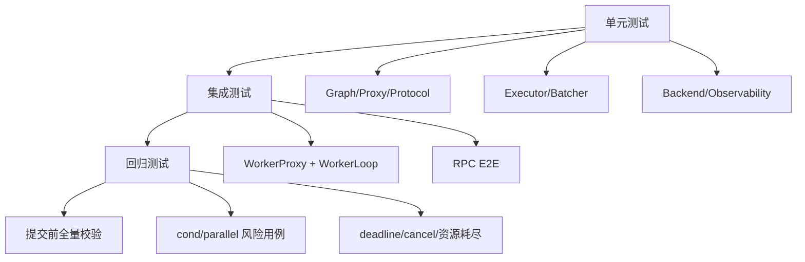

# Nerva 本地测试指南（单元测试 + 集成测试）

更新时间：2026-03-03

口径说明：本文聚焦“开发者本地验证闭环”，默认你在仓库根目录执行命令。

## 1. 为什么这套测试文档要分层

Nerva 同时涉及图语义、异步调度、进程边界、IPC 协议与服务端治理。只跑一种测试会留下明显盲区。

建议按三层思路组织验证：
- 单元层：验证局部语义正确。
- 集成层：验证跨模块链路正确。
- 回归层：覆盖历史事故和高风险路径。



## 2. 环境准备

### 2.1 依赖安装

```bash
uv sync --dev
```

按需安装后端额外依赖：

```bash
uv sync --dev --extra pytorch
uv sync --dev --extra vllm
```

### 2.2 基础检查命令

```bash
export PATH="$HOME/.local/bin:$PATH"
uv run ruff check src/ tests/ examples/ scripts/
uv run mypy
```

## 3. 推荐执行流程（开发日常）

### 3.1 改动前

1. 明确本次改动触达模块（例如 `core`/`worker`/`server`）。
2. 先跑对应模块的存量测试，确认基线不是红的。

### 3.2 改动中

1. 小步提交，每改一段逻辑就跑目标测试文件。
2. 异步/并发改动，优先补超时断言与负路径断言。

### 3.3 改动后

1. 跑局部 `ruff + pytest`。
2. 再跑全量 `ruff + mypy + pytest`。
3. 再看是否需要补回归用例。

## 4. 常用命令清单

### 4.1 局部改动快速检查

```bash
export PATH="$HOME/.local/bin:$PATH"
uv run ruff check src/ tests/
uv run pytest tests/<target_test>.py -v
```

### 4.2 提交前默认检查

```bash
export PATH="$HOME/.local/bin:$PATH"
uv run ruff check src/ tests/ examples/ scripts/
uv run mypy
uv run pytest tests/ -v
```

### 4.3 分场景测试

```bash
# 核心图语义
uv run pytest tests/test_graph.py tests/test_proxy.py tests/test_primitives.py -v

# 执行器与调度
uv run pytest tests/test_executor.py tests/test_batcher.py -v

# Worker/IPC
uv run pytest tests/test_worker_proxy.py tests/test_worker_process.py tests/test_worker_manager.py -v

# RPC 与协议
uv run pytest tests/test_protocol.py tests/test_rpc.py -v

# 服务端到端
uv run pytest tests/test_phase4_e2e.py tests/test_serve.py tests/test_phase5_e2e.py -v
```

## 5. 主要测试场景与文件映射

| 场景 | 代表测试文件 | 关注点 |
|---|---|---|
| Graph/trace/Proxy 构图 | `tests/test_graph.py`, `tests/test_proxy.py`, `tests/test_primitives.py` | 节点边关系、字段路径、分支图边界 |
| Executor 语义 | `tests/test_executor.py`, `tests/test_phase2_e2e.py` | 调度顺序、fail-fast、cond/parallel 行为 |
| Worker IPC | `tests/test_worker_proxy.py`, `tests/test_worker_process.py` | descriptor 编解码、deadline/cancel、SHM 路径 |
| 服务协议 | `tests/test_protocol.py`, `tests/test_rpc.py` | 帧编解码、header 校验、错误码映射 |
| 全链路可用性 | `tests/test_phase4_e2e.py`, `tests/test_serve.py` | Binary RPC + real worker end-to-end |
| 可观测性 | `tests/test_observability.py` | metrics registry、日志配置稳定性 |
| 性能工具正确性 | `tests/test_phase7_*.py`, `tests/test_phase2_bench.py` | loadgen/target/runner 合法性 |

## 6. 如何新增测试（实操模板）

### 6.1 新增单元测试

建议步骤：
1. 新建或定位 `tests/test_<module>.py`。
2. 一个测试只验证一个行为，输入尽量最小化。
3. happy path 与 failure path 至少各一条。
4. 本地执行目标 case，确保能稳定重复。

示例命令：

```bash
uv run pytest tests/test_executor.py::TestExecutor::test_parallel_node -v
```

### 6.2 新增集成测试

建议步骤：
1. 用 `tests/helpers.py` 中现成模型搭最小 pipeline。
2. 若涉及 worker 子进程，参考 `tests/test_phase4_e2e.py` fixture。
3. 明确 teardown，保证 `shutdown_all()` 或 `app.shutdown()` 执行。
4. 对超时场景添加 deadline 相关断言。

### 6.3 新增回归测试（并发/控制流改动必须）

建议结构：
- 复现输入：明确触发路径。
- 期望语义：不仅要“没报错”，还要“结果值正确”。
- 超时保护：避免死锁类问题被忽略。

## 7. 测试约定（仓库当前实践）

- `tests/conftest.py` 会自动清理模型注册表，避免 case 相互污染。
- 指标测试使用独立 `CollectorRegistry()`，避免 duplicated timeseries。
- `pytest` 配置为 `asyncio_mode=auto`，支持 `async def test_*`。
- 慢测试使用 `slow` marker 管理。

## 8. 针对典型改动的最小回归组合

### 8.1 改了 `core/primitives.py` 或 `engine/executor.py`

建议至少执行：

```bash
uv run pytest tests/test_primitives.py tests/test_executor.py tests/test_phase2_e2e.py -v
```

### 8.2 改了 `worker/*`

建议至少执行：

```bash
uv run pytest tests/test_worker_proxy.py tests/test_worker_process.py tests/test_worker_manager.py tests/test_phase4_e2e.py -v
```

### 8.3 改了 `server/rpc.py` 或 `server/protocol.py`

建议至少执行：

```bash
uv run pytest tests/test_protocol.py tests/test_rpc.py tests/test_phase4_e2e.py -v
```

## 9. 常见问题排查

- 现象：`Duplicated timeseries`。
- 原因：共享全局 prometheus registry。
- 处理：测试中使用 `NervaMetrics(registry=CollectorRegistry())`。

- 现象：测试结束后残留 worker 进程。
- 原因：teardown 未关闭 manager/app。
- 处理：补 `await manager.shutdown_all()` 或 `await app.shutdown()`。

- 现象：E2E 偶发超时。
- 原因：deadline 太短、机器负载高、慢路径未隔离。
- 处理：先本地降并发，确认功能正确后再升压。

## 10. 结束条件（本地可交付）

在声称“改动已完成”前，至少满足：
- 相关模块测试全部通过。
- `ruff`、`mypy` 通过。
- 若涉及并发/IPC/调度，包含新增回归测试或最小复现脚本。

