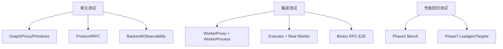

# Nerva 本地测试指南（单元测试 + 集成测试）

更新时间：2026-03-03

## 1. 测试目标

- 单元测试：验证核心模块在边界条件下行为正确。
- 集成测试：验证跨模块链路（RPC、Executor、Worker、Backend）可用。
- 回归测试：覆盖历史风险点，避免功能回退。

## 2. 环境准备

```bash
uv sync --dev
```

可选后端依赖：

```bash
uv sync --dev --extra pytorch
uv sync --dev --extra vllm
```

## 3. 常用执行命令

### 3.1 局部改动快速检查

```bash
export PATH="$HOME/.local/bin:$PATH"
uv run ruff check src/ tests/
uv run pytest tests/<target_test>.py -v
```

### 3.2 提交前默认检查

```bash
export PATH="$HOME/.local/bin:$PATH"
uv run ruff check src/ tests/ examples/ scripts/
uv run mypy
uv run pytest tests/ -v
```

### 3.3 只跑某一层测试

```bash
# 核心单元测试
uv run pytest tests/test_graph.py tests/test_proxy.py tests/test_protocol.py -v

# 执行器与原语
uv run pytest tests/test_executor.py tests/test_primitives.py -v

# 服务集成链路（含真实 Worker）
uv run pytest tests/test_phase4_e2e.py tests/test_serve.py -v

# 慢测试（如 benchmark 用例）
uv run pytest tests/test_phase2_bench.py -m slow -v -s
```

## 4. 主要测试场景



场景与文件映射：

| 场景 | 代表测试文件 |
|---|---|
| Graph/trace/Proxy 构图正确性 | `tests/test_graph.py`, `tests/test_proxy.py`, `tests/test_primitives.py` |
| Executor 调度与 cond/parallel 语义 | `tests/test_executor.py`, `tests/test_phase2_e2e.py` |
| Worker IPC 与生命周期 | `tests/test_worker_proxy.py`, `tests/test_worker_process.py`, `tests/test_worker_manager.py` |
| RPC 协议与错误映射 | `tests/test_protocol.py`, `tests/test_rpc.py` |
| 端到端服务可用性 | `tests/test_phase4_e2e.py`, `tests/test_phase5_e2e.py`, `tests/test_serve.py` |
| 可观测性与日志 | `tests/test_observability.py` |
| 性能工具链正确性 | `tests/test_phase7_*.py`, `tests/test_phase2_bench.py` |

## 5. 如何新增测试

### 5.1 新增单元测试

1. 选择对应模块的测试文件命名（`tests/test_<module>.py`）。
2. 使用 `tests/helpers.py` 里的测试模型，优先复用 `EchoModel`、`SlowModel` 等。
3. 断言最小行为单元，覆盖 happy path + failure path。
4. 运行目标测试并确认通过。

示例命令：

```bash
uv run pytest tests/test_executor.py::TestExecutor::test_cond_true_branch -v
```

### 5.2 新增集成测试

1. 若涉及 worker 子进程，优先参考 `tests/test_phase4_e2e.py` 的 fixture 组织方式。
2. 始终确保资源回收（`await manager.shutdown_all()` 或 `await app.shutdown()`）。
3. 对 deadline、cancel、资源耗尽场景补超时断言。

### 5.3 新增回归测试（建议模板）

- 先写失败用例再修复（TDD）。
- 每个历史缺陷至少包含：复现输入、期望行为、超时保护。
- 并发/分支语义问题必须断言“结果语义正确”，不只断言“不报错”。

## 6. 测试约定与注意事项

- `tests/conftest.py` 使用 `autouse` fixture 自动清理 `Model` 注册表，避免测试间污染。
- 指标测试请使用隔离 registry（`metrics` fixture）避免重复 timeseries。
- `pytest` 配置为 `asyncio_mode = auto`，异步测试可直接 `async def test_*`。
- `slow` 与 `gpu` marker 已预留；默认 CI/本地快测可先跳过慢测。

## 7. 常见问题

- 现象：`Duplicated timeseries`。
- 处理：使用 `NervaMetrics(registry=CollectorRegistry())` 的测试隔离写法。

- 现象：测试退出后残留 worker 进程。
- 处理：确认 teardown 里执行了 `shutdown_all()` 或 app 显式 `shutdown()`。

- 现象：E2E 测试偶发超时。
- 处理：检查 deadline 头、慢模型 delay、本机资源占用和并发设置。

