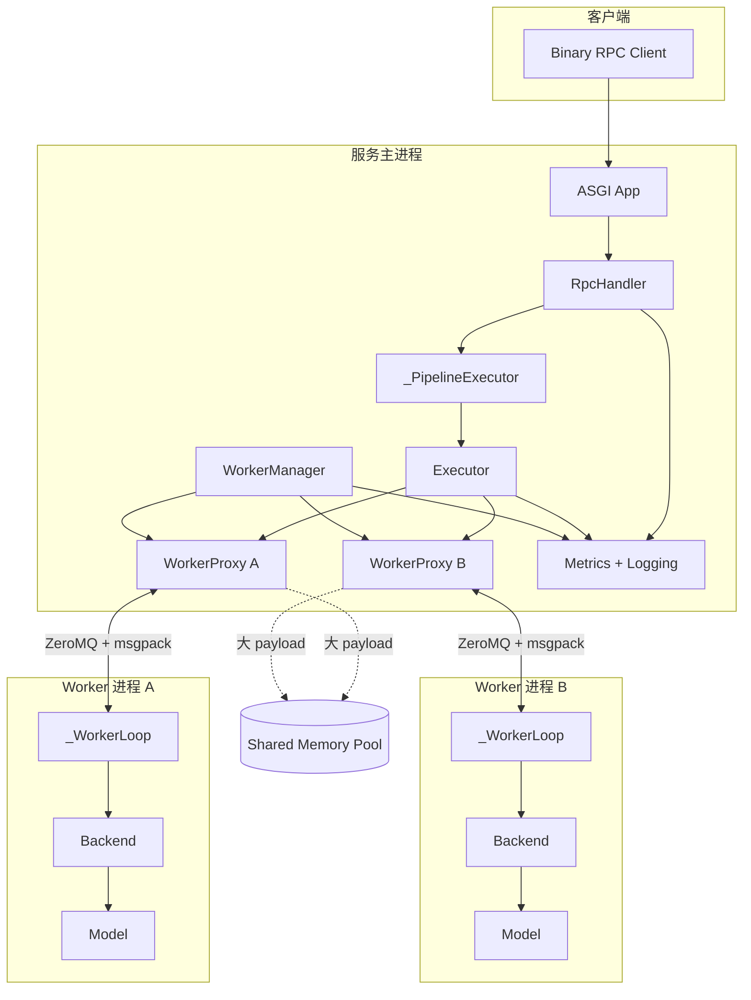
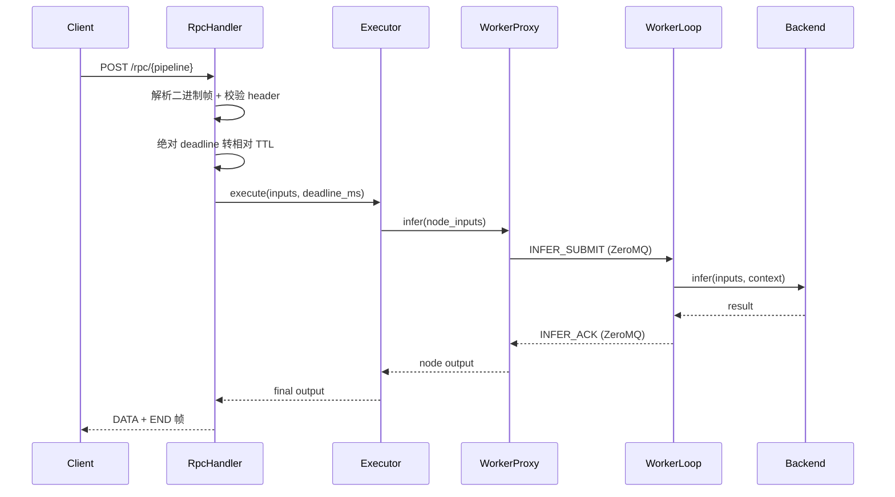
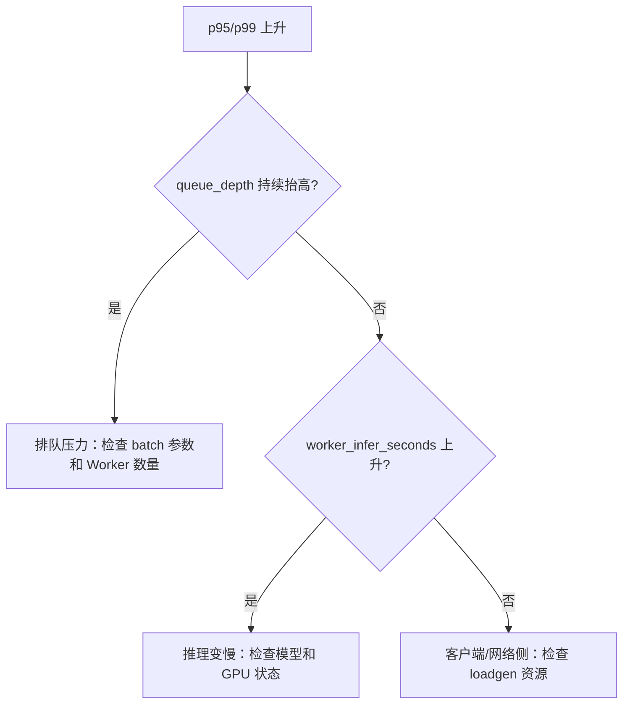
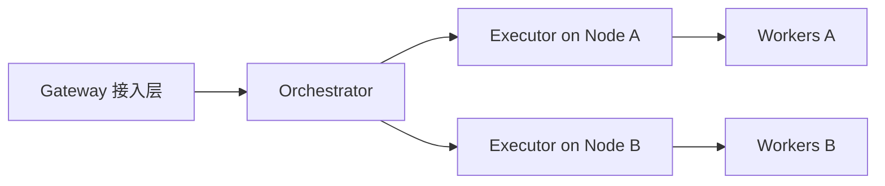

# Nerva 架构设计

更新时间：2026-03-12

## 1. Nerva 要解决什么问题

在生产环境里部署多模型推理服务，常见做法是用 Triton Inference Server。Triton 功能全面，但实际用下来有几个绕不开的问题：

- **配置驱动的模型编排灵活性不足。** Triton 的 ensemble 通过 YAML 配置组装流水线，DAG 表达能力有限——比如条件分支（根据输入选模型）和动态并行（按数据量拆分支），在 YAML 里很难自然表达。
- **Python 生态割裂。** Triton 的 C++/C# 核心要求算法工程师学习 model repository 结构、配置语法和 client SDK，离日常的 Python 开发体验有很大距离。
- **IPC 和 RPC 边界不透明。** 多模型串联时，数据在 Triton 内部经历多次序列化和跨进程拷贝，延迟来源难以定位，调优手段有限。

Nerva 的出发点就是这三个痛点。目标用户是希望把模型部署到生产环境、但不想处理复杂基础设施细节的算法工程师。

我们的回答是：

1. **Python-first**：模型定义、流水线编排、服务配置全用 Python，不引入额外语言。
2. **DAG 原生**：流水线就是一个 Python 函数，框架通过 `trace()` 自动推导计算图；`cond()`、`parallel()` 直接表达条件和并行语义。
3. **单机极致**：先把单机多 GPU 的延迟和吞吐做到位，不在 MVP 阶段引入分布式的复杂度。

这三条约束贯穿了后续所有架构决策。

## 2. 从约束推导架构

### 2.1 为什么是进程隔离

Python-first 意味着模型推理跑在 Python 进程里。但 Python 有 GIL：CPU-bound 操作（PyTorch CPU forward、数据预处理）会阻塞 event loop，影响同进程内其他模型的调度。

线程隔离方案在这个约束下不可行。即便用 `run_in_executor` 把推理放到线程池，GIL 仍然是瓶颈——两个 CPU-bound 模型不可能真正并行。

因此 Nerva 采用 **Master-Worker 多进程架构**：

- 每个 `model()` 声明对应一个独立的 Worker 进程。
- Master 进程只做 DAG 调度和 IPC 通信，不做推理计算。
- Worker 进程启动时通过 `CUDA_VISIBLE_DEVICES` 绑定 GPU，持有独立的 CUDA context。

这个模型的代价是 IPC 开销。但收益很明确：

- **GIL 无关**：模型推理在独立进程中执行，互不阻塞。
- **故障隔离**：单个模型 OOM 或 segfault 不会拖垮整个服务。
- **资源可控**：每个 Worker 的 CPU、GPU、内存占用可以独立观测和限制。

### 2.2 为什么是 ZeroMQ + 共享内存双通道

进程隔离带来了数据传输问题。推理服务的 payload 大小跨度很大：文本 tokenization 的输入可能只有几百字节，而多模态场景的图像数据可以到几 MB。

S1 spike（`docs/spikes/s1-ipc-benchmark-report.md`）的基准测试数据回答了"怎么传"的问题：

| Payload 大小 | UDS-only p50 | UDS+SHM p50 | 加速比 |
|---|---|---|---|
| 1 KB | 13.0 µs | 9.2 µs | 1.4× |
| 16 KB | 47.6 µs | 13.6 µs | 3.5× |
| 64 KB | 91.9 µs | 18.5 µs | 5.0× |
| 1 MB | 778.8 µs | 44.3 µs | 17.6× |
| 4 MB | 4460.5 µs | 133.2 µs | 33.5× |

关键观察：

- **16 KB 以下，SHM 的收益不明显**——SHM 本身有 alloc/free 开销，小 payload 反而不划算。
- **64 KB 及以上，SHM 的优势从 5 倍扩大到 33 倍**——UDS 的延迟随 payload 线性增长（内存拷贝主导），SHM 几乎不变（只传 descriptor）。
- **尾延迟稳定性**：4 MB 时 UDS-only 的 p99/p50 比达到 4.4，而 UDS+SHM 不到 3。

基于这些数据，Nerva 采用双通道设计：

- **控制通道**：ZeroMQ PAIR over `ipc://`，传输控制消息和 descriptor（msgpack 编码）。
- **数据通道**：POSIX 共享内存池，大 payload 写入 SHM，控制通道只传元数据。
- **分界线**：`IPC_CONTROL_INLINE_MAX_BYTES = 8 KB`。小于等于 8 KB 的 payload 直接 inline 进控制消息。

为什么选 ZeroMQ 而不是自写 UDS 帧解析：ZeroMQ PAIR 提供原生消息边界定界和内建心跳检测，省去手写 length-prefix parser 和 heartbeat 逻辑。pyzmq 是成熟的单一依赖（约 500 KB wheel），S1 数据确认 ZeroMQ over `ipc://` 的延迟与原始 UDS 在同一量级。

### 2.3 为什么用 trace 构图

多模型编排需要表达模型之间的依赖关系。传统做法是让用户显式构建 DAG——声明节点、手写边、指定输入输出映射。这种方式可靠，但样板代码多，改一个模型的输入输出要同步改多处映射关系。

Nerva 提供了另一条路径：`trace()`。用户写一个普通 Python 函数来描述流水线，框架在执行这个函数时用 `Proxy` 占位对象拦截所有模型调用，自动推导出计算图。

S2 spike（`docs/spikes/s2-trace-prototype-report.md`）验证了这个方案的可行性，测试覆盖了线性链、并行、条件分支、菱形依赖和复杂 DAG 五种拓扑。

**trace 的受限子集策略**：trace 不试图支持任意 Python 语义——不支持副作用、动态循环、运行时条件判断。它只捕获模型调用（`ModelHandle.__call__`）和控制流原语（`cond()`、`parallel()`）。对于 trace 无法处理的模式，框架抛出明确的错误信息，引导用户回退到显式 DAG API。

这是设计评审中反复讨论的权衡（`docs/plans/2026-02-25-design-review.md`，P1-4）：trace 降低常见场景的样板代码，显式 DAG 保证复杂场景的可预测性，两者互补而非替代。

### 2.4 为什么自研 Binary RPC

设计评审的第二个核心争议（P0-2）是协议选型。gRPC 是 ML serving 的标准选择，成熟且跨语言互操作。但 Nerva 的 MVP 定位是单机推理服务，不需要跨域部署，也不需要异构语言 client。

自研协议的收益：

- 二进制流式输入（音频、图像）的 wire format 可以精确控制，不经过 protobuf 编码。
- 无 protobuf 编译依赖，部署更轻量。
- deadline、cancel、backpressure 等语义可以按需嵌入帧头，不受 gRPC metadata 的约束。

协议的代价是缺少现成的调试工具（没有 grpcurl）和 client SDK。设计评审的结论是：MVP 先从最简单的音频数据传输场景做起，后续再增加 HTTP+JSON 的可选路径。

## 3. 总体架构



### 分层职责

| 层 | 主要文件 | 职责 | 关注的质量属性 |
|---|---|---|---|
| DSL/图层 | `core/model.py`, `core/proxy.py`, `core/graph.py`, `core/primitives.py` | 从函数定义构图，表达依赖和控制流 | 易用性、正确性 |
| 执行层 | `engine/executor.py`, `engine/batcher.py` | DAG 调度、动态批处理、请求上下文传递 | 并发度、吞吐 |
| 进程/IPC 层 | `worker/manager.py`, `worker/proxy.py`, `worker/process.py`, `worker/ipc.py`, `engine/shm_pool.py` | Worker 生命周期、跨进程通信、共享内存管理 | 延迟、隔离性、资源回收 |
| 服务层 | `server/protocol.py`, `server/rpc.py`, `server/serve.py`, `server/app.py` | 对外协议、请求治理（deadline/cancel）、服务装配 | 可靠性、可观测 |
| 后端层 | `backends/base.py`, `backends/pytorch.py`, `backends/vllm.py` | 模型后端抽象与具体实现 | 扩展性 |
| 可观测层 | `observability/metrics.py`, `observability/logging.py` | Prometheus 指标、structlog 结构化日志 | 可诊断性 |

## 4. 一次请求的生命周期

以 `POST /rpc/{pipeline}` 为例，一个请求从进入到返回经历以下阶段：



几个容易忽略的细节：

1. **deadline 转换**：客户端发送的是绝对时间戳（`x-nerva-deadline-ms`），RpcHandler 在入口转换为相对 TTL，之后每一层都用相对时间做超时判断，避免时钟偏移问题。
2. **请求 ID 透传**：`request_id` 从入口生成，经 Executor、WorkerProxy、WorkerLoop 一路透传到 Backend，日志和指标都绑定同一个 ID。排障时用这个 ID 把各层日志串起来。
3. **IPC 路径选择**：WorkerProxy 发送 `INFER_SUBMIT` 时检查 payload 大小。≤8 KB 直接 inline 进 ZeroMQ 消息；>8 KB 先写入 SHM，控制消息只携带 descriptor（shm_id + offset + length）。

## 5. 执行模型

### 5.1 DAG 调度：事件驱动，不是串行遍历

`Executor` 不是按拓扑序逐个执行节点。它维护一张入度表（in-degree table）和一个完成队列（done_queue），调度逻辑是纯事件驱动的：

1. 初始化时计算每个节点的入度。入度为 0 的节点立即 `create_task` 启动。
2. 节点完成后把自己的 `node_id` 放入 `done_queue`。
3. 主循环消费 `done_queue`，将完成节点的所有后继的入度减 1。入度降到 0 的后继立即调度。

这意味着 DAG 中所有无依赖关系的节点会自然并行执行，不需要用户显式标记哪些可以并行。

### 5.2 并发的三个层次

Nerva 的并发不只发生在"多个请求之间"。一个请求内部也有并发：

- **请求间**：不同请求的 DAG 独立执行，互不阻塞。
- **请求内（DAG 层）**：同一 DAG 中没有依赖关系的节点并行调度。`parallel()` 节点的各分支子图并发执行。
- **进程间**：每个 Worker 是独立进程，多个 Worker 可以真正并行处理不同节点的推理请求。

### 5.3 资源控制

并发不是无限放开的。系统里有几道闸门防止过载：

- **DynamicBatcher.queue_capacity**：限制每个模型的排队深度。队列满时返回 `RESOURCE_EXHAUSTED`，而不是无声堆积。
- **queue_timeout_ms + deadline**：请求在队列中等待时间超过 deadline 残余时间，直接丢弃而不进入推理，避免已过期的请求浪费 GPU 时间。
- **SHM slot**：共享内存池按 size class 预分配 slab，slot 耗尽时快速失败而不是阻塞等待。

设计原则是：**触发上限时走显式失败和明确错误码，而不是隐式堆积到超时雪崩。**

### 5.4 故障处理

| 故障场景 | 处理策略 |
|---|---|
| DAG 中某节点推理失败 | fail-fast：取消该请求 DAG 中所有未完成的节点，返回错误。不做重试。 |
| Worker 进程崩溃 | WorkerManager 按退避策略重启（1s → 2s → 4s → ... → 16s，最多 5 次）。崩溃时在途请求返回 `UNAVAILABLE`。 |
| Worker 启动失败 | 回滚清理。不会留下半初始化的 Worker。 |
| 请求超过 deadline | RpcHandler 在入口拒绝已过期请求。执行中的请求超时后，Worker 通过 `context.cancelled` 检查并中止推理。 |
| SHM 池耗尽 | 返回 `RESOURCE_EXHAUSTED`。不阻塞等待。 |
| 父进程意外退出 | Worker 内置 watchdog，检测父进程消失后自行退出，防止孤儿进程。 |

Pipeline 级别的语义是 **fail-fast**：任一关键节点失败，整条请求立即失败。这是 MVP 的有意选择——重试和降级策略留给上层（网关或客户端）处理，框架只保证失败是快速且可诊断的。

## 6. 可观测性

关键指标：

| 指标 | 含义 | 排障用途 |
|---|---|---|
| `nerva_request_total` | 请求总量（按 pipeline、状态码分） | 流量趋势、错误率 |
| `nerva_request_duration_seconds` | 请求端到端延迟 | 延迟分布和回归 |
| `nerva_request_in_flight` | 当前在途请求数 | 并发压力 |
| `nerva_batch_size` | 实际批大小 | 批处理效率 |
| `nerva_batch_wait_seconds` | 批次等待时间 | 排队延迟 |
| `nerva_queue_depth` | 当前队列深度 | 排队压力 |
| `nerva_worker_status` | Worker 状态 | 进程健康 |

日志通过 `request_id` 和 `pipeline` 绑定上下文。排障时用 `request_id` 把入口日志、Executor 日志、Worker 日志串联，是定位延迟来源最快的路径。

延迟定位的经验判断：



## 7. 当前边界与演进方向

### 7.1 当前不做什么

- **分布式调度**：当前实现是单机多进程。不支持跨机器的 Worker 调度。
- **流式推理**：协议帧头保留了 `x-nerva-stream` 字段，但当前只支持 `0`（unary）。
- **动态模型加卸载**：`/v1/models` 端点只读，不支持运行时加载新模型。
- **YAML/声明式配置**：MVP 阶段纯代码配置。
- **Trace 的完整 Python 语义**：只支持模型调用 + `cond`/`parallel` + 简单表达式。不支持循环、副作用、运行时条件。

### 7.2 走向未来的路径

**分布式扩展**沿现有进程边界外推，不需要重写核心调度逻辑：



- `RpcHandler` 前面加网关层，负责接入和限流。
- `WorkerManager` 的"本机进程管理"抽象为"远端执行单元注册/探活"。
- `Executor` 保留 DAG 语义不变，只替换节点执行位置的解析逻辑（本机 → 远端）。

**Master 进程性能瓶颈**的预期解法：当 DAG 调度、序列化、数据拼接等 CPU-bound 操作成为瓶颈时，将热路径 offload 到 Rust/C++ 线程池。这不违背 Python-first 原则——用户 API 层面仍然是纯 Python，性能关键路径由框架内部优化（类似 NumPy 的模式）。

**协议扩展**：在 Binary RPC 基础上增加 HTTP+JSON 可选路径，降低纯文本场景的接入门槛。Binary RPC 继续用于大 payload 和低延迟场景。

## 8. 回归风险提醒

已知高风险点：`cond`/`parallel` 分支中捕获上游 `Proxy` 的边界处理（标记 `R-PH2-PROXY-CAPTURE`）。

改动涉及 `core/primitives.py` 或 `engine/executor.py` 时，务必保留这两类回归用例：

```python
out = a(x); cond(out["flag"], lambda: b(out), lambda: c(out))
out = a(x); parallel(lambda: b(out), lambda: c(out))
```

不要只断言"不报错"——要断言分支输入和分支输出都正确。
