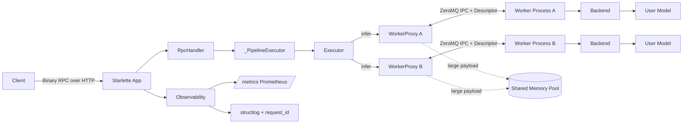
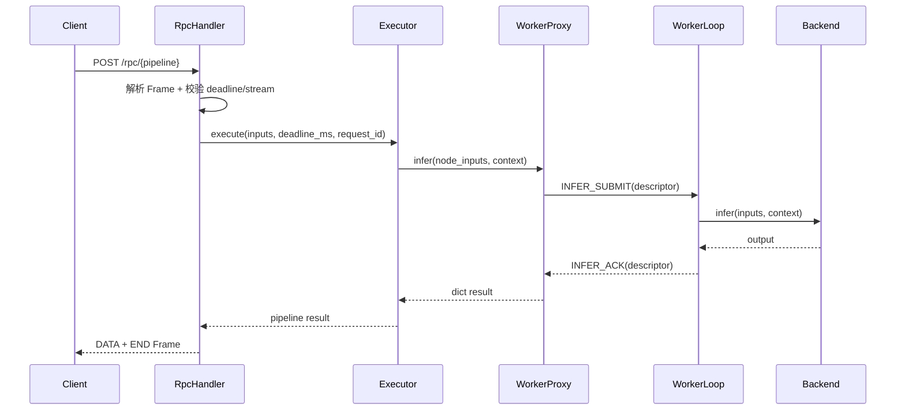

# Nerva 架构设计

更新时间：2026-03-03

## 1. 设计目标

Nerva 是一个 Python 原生推理服务框架，目标是把“可编排性”和“高性能推理链路”放在同一个框架中。

核心目标：
- 低延迟、高吞吐的推理服务能力。
- 多模型 DAG 编排（含 `cond` / `parallel` 控制流）。
- 进程隔离的模型执行（稳定性优先）。
- 统一后端抽象（当前内置 PyTorch、vLLM）。
- 可观测性可落地（指标、结构化日志、请求链路 ID）。

## 2. 整体架构



### 架构分层

- 接入层：`server/protocol.py` + `server/rpc.py`，负责协议、校验、错误映射。
- 编排层：`core/*` + `engine/executor.py`，负责 trace 构图与 DAG 执行。
- 执行层：`worker/*` + `backends/*`，负责进程生命周期与模型推理。
- 观测层：`observability/*`，负责指标和日志。

## 3. 请求生命周期



## 4. 代码结构

```text
src/nerva/
  core/           # Model 声明、Proxy tracing、Graph IR、cond/parallel 原语
  engine/         # Executor、DynamicBatcher、ShmPool
  worker/         # WorkerManager、WorkerProxy、WorkerLoop、IPC 协议
  server/         # Binary RPC 协议、路由、ASGI/serve 入口
  backends/       # Backend 抽象与 pytorch/vllm 实现
  observability/  # Prometheus 指标与 structlog 配置
```

关键目录职责：

| 目录 | 主要文件 | 责任 |
|---|---|---|
| `src/nerva/core` | `model.py`, `proxy.py`, `graph.py`, `primitives.py` | Pipeline DSL 与 Graph IR |
| `src/nerva/engine` | `executor.py`, `batcher.py`, `shm_pool.py` | DAG 调度、批处理、共享内存池 |
| `src/nerva/worker` | `manager.py`, `proxy.py`, `process.py`, `ipc.py` | 进程管理与 IPC 数据通道 |
| `src/nerva/server` | `serve.py`, `rpc.py`, `protocol.py`, `app.py` | 服务启动、二进制 RPC 协议与路由 |
| `src/nerva/backends` | `base.py`, `pytorch.py`, `vllm.py` | 后端抽象与具体后端实现 |
| `src/nerva/observability` | `metrics.py`, `logging.py` | 指标与日志能力 |

## 5. 主体设计

### 5.1 Pipeline 构图

- 用户通过 `model(...)` 声明 `ModelHandle`。
- `trace(fn)` 时，输入被替换为 `Proxy`，`ModelHandle.__call__` 记录 `Node/Edge`。
- `cond()`、`parallel()` 在 trace 期间生成子图，执行期由 Executor 解释。

### 5.2 DAG 执行模型

- `Executor` 使用 in-degree + `done_queue` 事件驱动并发调度。
- fail-fast：任一节点失败会取消其余节点任务并向上抛错。
- `cond` 节点只执行命中分支；`parallel` 节点并发执行所有分支子图。

### 5.3 进程隔离与 IPC

- 每个模型默认对应一个 Worker 进程（`WorkerManager.start_worker`）。
- 控制消息通过 ZeroMQ PAIR + msgpack（`worker/ipc.py`）。
- 小 payload 走 inline；大 payload 通过共享内存槽位（`engine/shm_pool.py` + descriptor）。

### 5.4 服务生命周期

- `build_nerva_app(...)` 返回 ASGI app。
- 在支持 lifespan 的宿主（如 uvicorn）中，startup/shutdown 驱动 worker 生命周期。
- 在不发送 lifespan 的场景（如部分测试 transport），使用“首请求懒启动 + `app.shutdown()`”收尾。

## 6. 对外接口与协议

- 服务入口：`build_nerva_app(pipelines)`、`serve(pipelines, host, port)`。
- RPC 端点：`POST /rpc/{pipeline_name}`。
- 管理端点：`GET /v1/health`、`GET /v1/models`、`GET /metrics`。
- 协议头：固定 32-byte header，Frame 类型包括 `OPEN` / `DATA` / `END` / `ERROR`。

## 7. 可观测性与运维要点

- 指标：`nerva_request_total`、`nerva_request_duration_seconds`、`nerva_request_in_flight`、`nerva_batch_size`、`nerva_queue_depth`、`nerva_worker_status` 等。
- 日志：`structlog` + `contextvars` 绑定 `request_id`、`pipeline`。
- 运维建议：通过 `request_id` 贯通 RPC 日志与 worker 异常日志。

## 8. 当前风险（文档口径）

- 风险 ID：`R-PH2-PROXY-CAPTURE`
- 风险描述：`cond()/parallel()` 分支若错误捕获上游 Proxy，可能造成语义错误或阻塞。
- 回归重点：
  - `out = a(x); cond(out["flag"], lambda: b(out), lambda: c(out))`
  - `out = a(x); parallel(lambda: b(out), lambda: c(out))`

