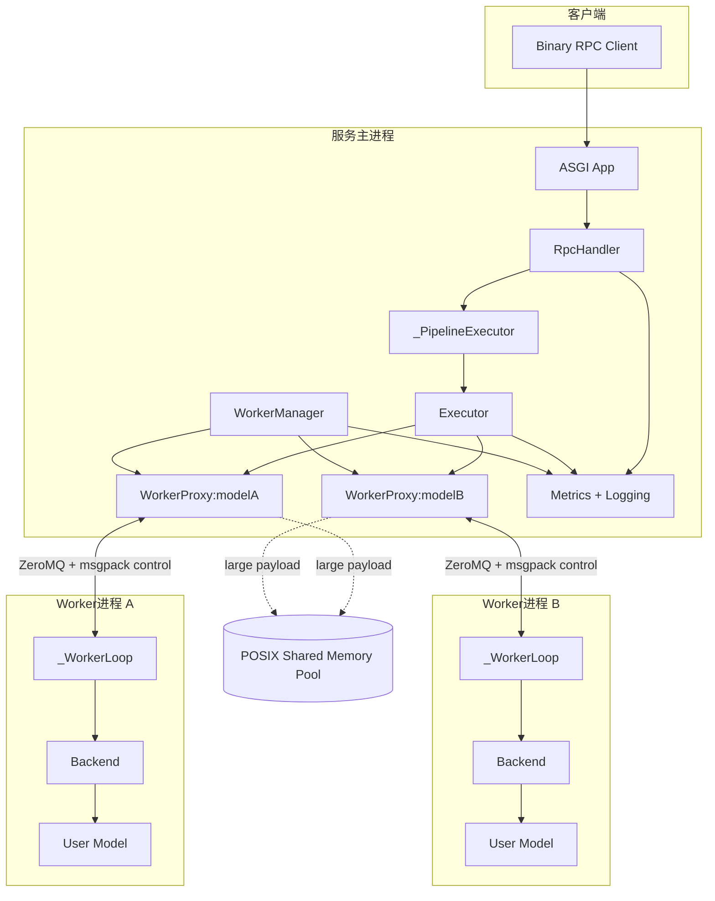
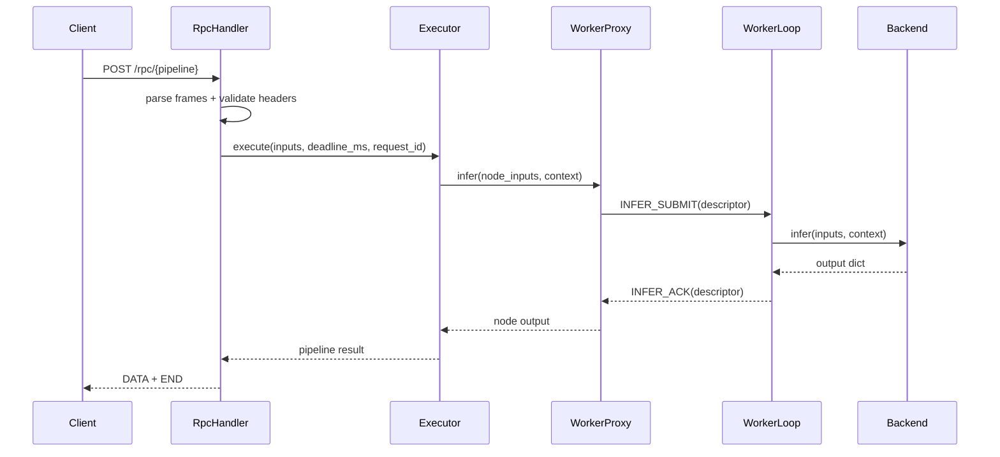
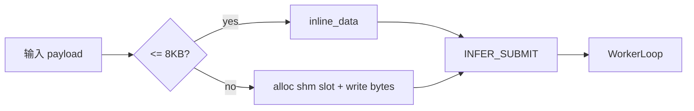

# Nerva 架构设计

更新时间：2026-03-03

口径说明：本文基于当前仓库代码实现整理（非运行时探针结论）。涉及具体实现可对应到 `src/nerva/` 下模块。

## 1. 先说结论：Nerva 在解决什么问题

Nerva 的核心目标不是“再做一个模型服务框架”，而是在 Python 生态里，把三件经常冲突的事情放到一个可控系统里：

- 编排灵活：算法同学能用接近普通 Python 函数的方式定义多模型 DAG。
- 执行稳定：模型执行放进独立 Worker 进程，避免单点崩溃拖垮全局。
- 性能可调：提供低开销 IPC、动态批处理、统一可观测性，便于定位瓶颈。

从工程视角看，Nerva 的取舍是“保守但可演进”：先把链路跑通且可验证，再逐步叠加更复杂能力。

## 2. 设计原则

### 2.1 清晰的分层边界

- `core` 负责 DSL 和图语义，不处理网络和进程。
- `engine` 负责 DAG 调度和执行期策略。
- `worker` 负责进程与 IPC 生命周期。
- `server` 负责对外协议和请求治理。
- `backends` 负责模型执行适配。

边界清晰的好处是：改协议不必改执行器，改后端不必改 RPC，改调度不必改模型定义。

### 2.2 失败隔离优先于“单进程极致性能”

每个模型默认对应独立 Worker 进程。这样做会引入 IPC 成本，但换来更好的容错和治理能力，尤其在多模型场景下更可控。

### 2.3 明确协议和显式治理

RPC 使用二进制帧协议，deadline、stream mode、错误码映射都在入口统一处理。系统尽量避免“隐式容忍”，优先给出可诊断的失败。

### 2.4 可观测性内建

指标、日志上下文（`request_id`）是系统设计的一部分，不是上线后临时补丁。

## 3. 全局架构图

## 4. 从一次请求看系统行为

这是最实用的阅读方式。假设客户端发起 `POST /rpc/echo`：

1. `RpcHandler` 解析二进制帧，检查必须头（`x-nerva-deadline-ms`、`x-nerva-stream`）。
2. 入口将绝对 deadline 转换为相对 TTL，绑定 `request_id` 上下文。
3. `_PipelineExecutor` 创建本次请求的 `InferContext`，交给 `Executor`。
4. `Executor` 按 DAG 依赖调度节点，对每个 `call` 节点调用对应 `WorkerProxy.infer`。
5. `WorkerProxy` 通过 IPC 向 Worker 发 `INFER_SUBMIT`；大 payload 可走 SHM 描述符路径。
6. Worker 子进程执行 `Backend.infer`，返回 `INFER_ACK`。
7. `Executor` 收集节点结果，产出 pipeline 终值。
8. `RpcHandler` 组装 `DATA + END` 帧回包，并写入指标。

## 5. 核心组件职责

| 组件 | 代码位置 | 主要职责 | 关键约束 |
|---|---|---|---|
| `Graph/Node/Edge` | `core/graph.py` | 表达 DAG 结构与依赖 | 必须可拓扑排序 |
| `trace/Proxy` | `core/proxy.py` | 将 Python 函数调用追踪为图 | 仅在 trace 上下文有效 |
| `cond/parallel` | `core/primitives.py` | 构造控制流子图 | 分支图必须避免跨图边 |
| `Executor` | `engine/executor.py` | 事件驱动执行 DAG | fail-fast，节点级上下文 |
| `DynamicBatcher` | `engine/batcher.py` | 批处理与排队治理 | deadline 与 backpressure 生效 |
| `WorkerManager` | `worker/manager.py` | Worker 生命周期管理 | 一模型一 Worker（当前口径） |
| `WorkerProxy` | `worker/proxy.py` | 主进程到 Worker 的 RPC 抽象 | 请求 ID 必须唯一 |
| `_WorkerLoop` | `worker/process.py` | 子进程消息循环与推理执行 | 处理 cancel、timeout、ack |
| `RpcHandler` | `server/rpc.py` | 协议入口、错误映射、响应组帧 | 当前仅支持 unary (`x-nerva-stream=0`) |

## 6. 并发与隔离模型

### 6.1 主进程并发

- `Executor` 用 in-degree 表 + `done_queue` 驱动并发调度。
- 依赖满足即调度，不强制串行。
- 任一节点报错后，统一取消剩余任务并抛出。

### 6.2 子进程并发

- 每个 Worker 是独立进程，内部 `_WorkerLoop` 处理消息。
- `INFER_SUBMIT` 会派生异步任务；可被 `CANCEL` 终止。
- Backend 执行超时由 deadline 驱动（例如 `asyncio.wait_for`）。

### 6.3 语义隔离

- 一个模型崩溃不会直接破坏其他模型进程。
- 进程边界为稳定性与可恢复性提供基本保障。

## 7. IPC 与数据通道设计

### 7.1 控制通道

- 介质：ZeroMQ PAIR。
- 编码：msgpack。
- 作用：控制消息、描述符交换、状态 ACK。

### 7.2 数据通道

- 小 payload：inline 放在 descriptor。
- 大 payload：通过 SHM 槽位传输，减少重复拷贝。
- 当前 inline 阈值：`IPC_CONTROL_INLINE_MAX_BYTES = 8 * 1024`。

## 8. 服务生命周期与资源回收

- `build_nerva_app(...)` 返回可直接挂 ASGI 的应用。
- 在 `uvicorn` 等支持 lifespan 的场景：startup 启动 worker，shutdown 回收 worker。
- 在不发 lifespan 的测试场景：应用支持懒启动，需显式 `await app.shutdown()` 保障清理。
- 存在父进程 watchdog 机制，避免孤儿服务进程长期存活。

## 9. 错误处理与故障语义

### 9.1 RPC 入口错误码

- `INVALID_ARGUMENT (3)`：协议错误、参数非法、未知 pipeline。
- `DEADLINE_EXCEEDED (4)`：请求已过期或执行超时。
- `RESOURCE_EXHAUSTED (8)`：资源不足（如队列/SHM 容量压力）。
- `INTERNAL (13)`：未分类内部错误。

### 9.2 执行器故障策略

- 任何节点异常都视为本次 DAG 执行失败。
- 失败后进行任务取消，避免无意义继续执行。

### 9.3 Worker 故障策略

- 管理器可重启 worker（带重启计数上限）。
- shutdown 阶段进行 best-effort 关闭与进程回收。

## 10. 可观测性设计

关键指标（部分）：
- `nerva_request_total`
- `nerva_request_duration_seconds`
- `nerva_request_in_flight`
- `nerva_batch_size`
- `nerva_batch_wait_seconds`
- `nerva_queue_depth`
- `nerva_worker_status`
- `nerva_worker_infer_seconds`

日志侧：
- 通过 `structlog.contextvars` 注入 `request_id`、`pipeline`。
- 推荐用 `request_id` 串联“入口日志 -> 执行器日志 -> worker 日志”。

## 11. 当前边界与非目标

当前边界：
- 传输协议为 unary 二进制 RPC 主路径。
- 服务注册与执行模型以单机进程管理为主。
- 内置后端聚焦 PyTorch 与 vLLM。

非目标（当前阶段）：
- 分布式调度与跨节点一致性治理。
- 复杂控制流原语全集（如 `switch`、`fori_loop`）。
- 完整的控制平面（模型仓库、版本治理、租户级策略）。

## 12. 风险与回归关注

已知风险（文档口径）
- 风险 ID：`R-PH2-PROXY-CAPTURE`
- 触发形态：`cond/parallel` 分支错误捕获上游 `Proxy`。
- 影响：可能语义错误或执行卡住。

建议的必测用例：
- `out = a(x); cond(out["flag"], lambda: b(out), lambda: c(out))`
- `out = a(x); parallel(lambda: b(out), lambda: c(out))`

