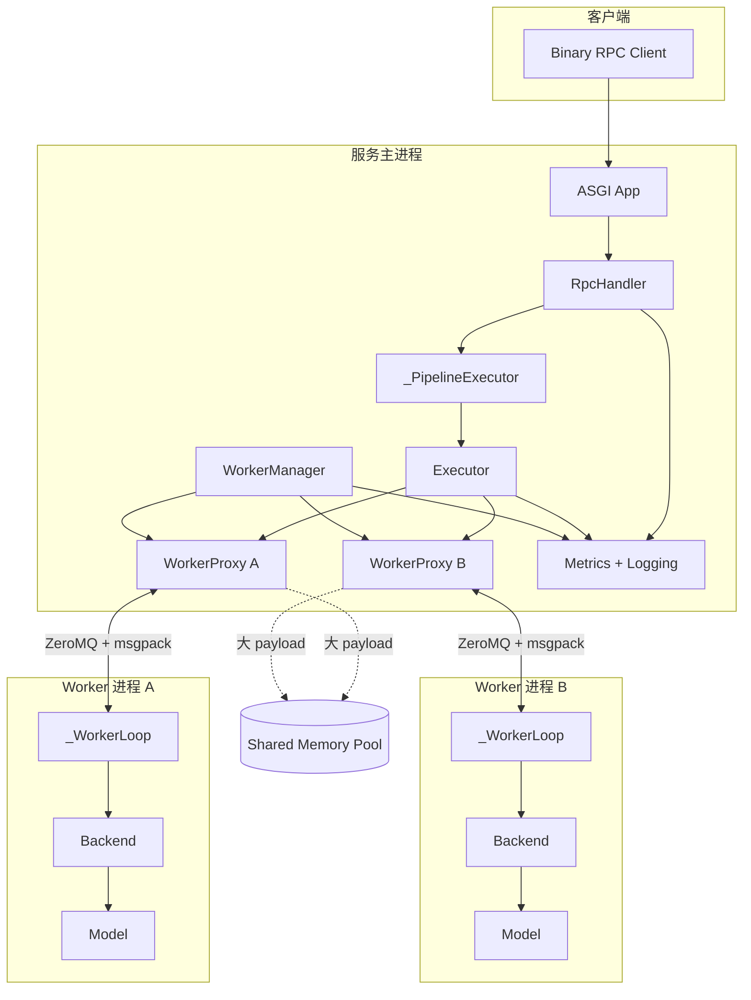
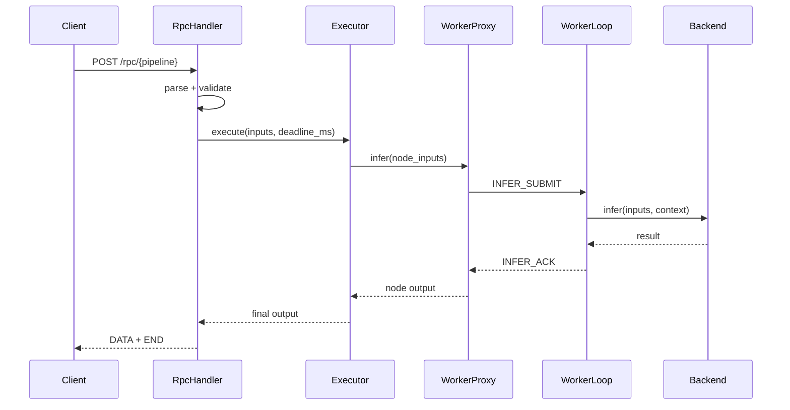
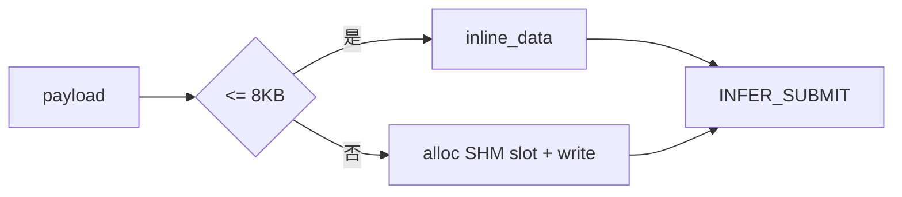

# Nerva 架构设计

更新时间：2026-03-03

本文按当前仓库实现整理，重点回答三个问题：
- Nerva 的核心链路是什么。
- 各层分别负责什么。
- 出问题时应该先看哪里。

## 1. 设计目标（工程视角）

Nerva 的目标很直接：让多模型编排和推理服务能在同一套 Python 框架里高效运行，同时还具备灵活快速的开发效率。

这背后有三条约束：
- 编排要灵活：用户可以用普通函数风格定义 DAG。
- 执行要稳定：模型运行放到独立 Worker 进程，避免互相拖垮。
- 诊断要清晰：指标、日志、错误码需要能对应到具体阶段。

## 2. 总体架构

## 3. 一次请求的主链路

以 `POST /rpc/{pipeline}` 为例：

1. `RpcHandler` 校验 header 和二进制帧格式。
2. 把绝对 deadline 转成相对 TTL，生成请求上下文。
3. `_PipelineExecutor` 创建 `Executor` 执行 DAG。
4. `Executor` 按依赖调度节点，调用对应 `WorkerProxy.infer`。
5. `WorkerProxy` 通过 IPC 把请求发给 Worker。
6. Worker 执行 `Backend.infer`，再返回 ACK。
7. `Executor` 收敛结果，`RpcHandler` 组帧回包。

## 4. 分层职责

| 层 | 主要文件 | 责任 |
|---|---|---|
| DSL/图层 | `core/model.py`, `core/proxy.py`, `core/graph.py`, `core/primitives.py` | 从函数定义构图，表达依赖和控制流 |
| 执行层 | `engine/executor.py`, `engine/batcher.py` | DAG 调度、批处理、请求级上下文传递 |
| 进程/IPC 层 | `worker/manager.py`, `worker/proxy.py`, `worker/process.py`, `worker/ipc.py` | worker 生命周期与跨进程通信 |
| 服务层 | `server/protocol.py`, `server/rpc.py`, `server/serve.py`, `server/app.py` | 对外协议、请求治理、服务装配 |
| 后端层 | `backends/base.py`, `backends/pytorch.py`, `backends/vllm.py` | 模型后端抽象与具体实现 |
| 可观测层 | `observability/metrics.py`, `observability/logging.py` | 指标与结构化日志 |

## 5. 并发与隔离模型

### 5.1 主进程并发

`Executor` 用 in-degree + 完成队列驱动调度。依赖满足就立即执行，不强行串行。任一节点出错后，会取消剩余任务并 fail-fast 返回。

### 5.2 Worker 并发

每个 Worker 是独立进程，`_WorkerLoop` 接收请求后创建任务执行，支持取消和超时。

### 5.3 隔离收益

进程隔离带来了 IPC 成本，但换来更清晰的故障边界。一个模型异常时，不会直接把其他模型一起带崩。

## 6. IPC 设计

- 控制通道：ZeroMQ PAIR + msgpack，传控制消息和 descriptor。
- 数据通道：小 payload inline，大 payload 走 SHM。

当前 inline 阈值：`IPC_CONTROL_INLINE_MAX_BYTES = 8 * 1024`。

## 7. 错误处理策略

### 7.1 RPC 层错误码

- `INVALID_ARGUMENT (3)`：协议或参数问题。
- `DEADLINE_EXCEEDED (4)`：请求超时或已过期。
- `RESOURCE_EXHAUSTED (8)`：资源不足（排队/容量压力）。
- `INTERNAL (13)`：未分类内部错误。

### 7.2 执行层策略

- 节点异常直接终止本次 DAG。
- 取消剩余任务，避免无效计算继续占资源。

### 7.3 Worker 生命周期

- 启动失败会回滚清理。
- 支持重启（有限次数）。
- 关停阶段走 best-effort，最终保证进程回收。

## 8. 可观测性

关键指标（部分）：
- `nerva_request_total`
- `nerva_request_duration_seconds`
- `nerva_request_in_flight`
- `nerva_batch_size`
- `nerva_batch_wait_seconds`
- `nerva_queue_depth`
- `nerva_worker_status`

日志通过 `request_id` 与 `pipeline` 绑定上下文。排障时建议用 `request_id` 把入口日志、执行器日志、worker 日志串起来看。

## 9. 当前边界

当前主路径是 unary Binary RPC；`x-nerva-stream` 仅支持 `0`。框架重点覆盖单机进程模型，复杂控制平面（例如模型仓库治理、租户策略）不在当前实现范围内。

## 10. 回归风险提醒

已知高风险点（文档口径）：`R-PH2-PROXY-CAPTURE`。

建议持续保留这两类回归：
- `out = a(x); cond(out["flag"], lambda: b(out), lambda: c(out))`
- `out = a(x); parallel(lambda: b(out), lambda: c(out))`

